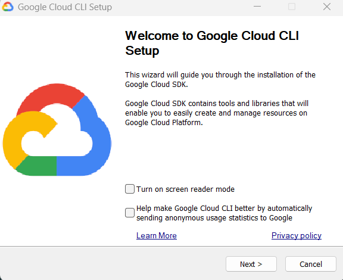
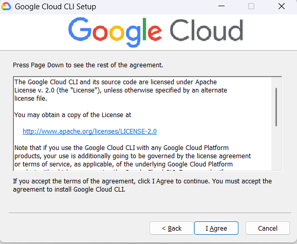
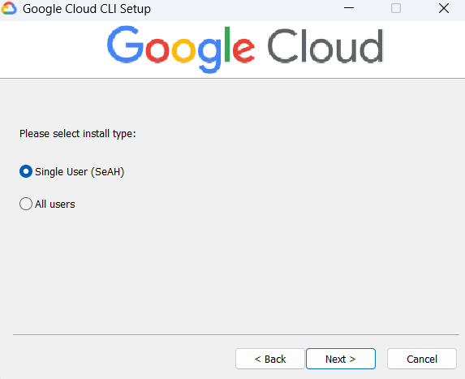
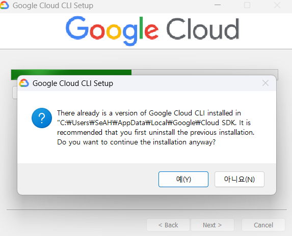
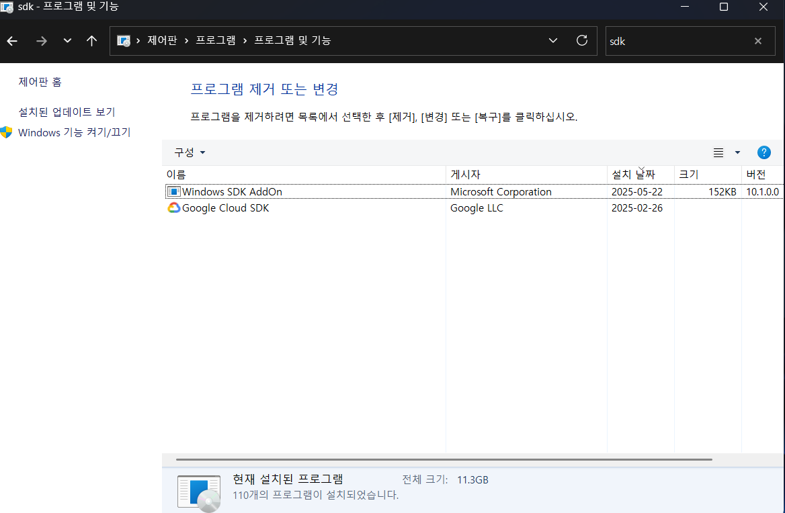
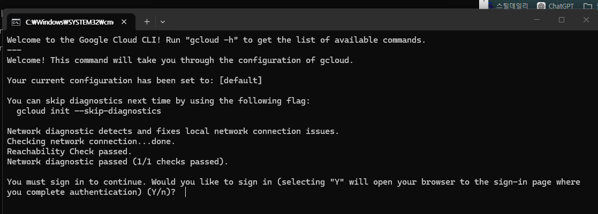
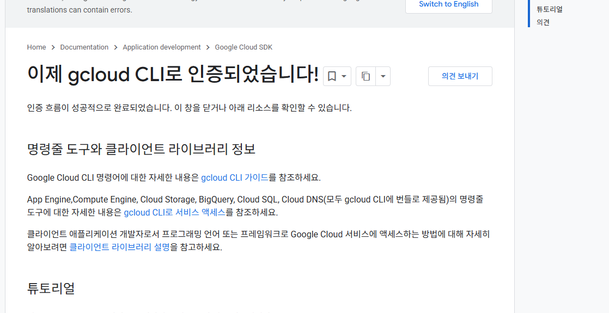
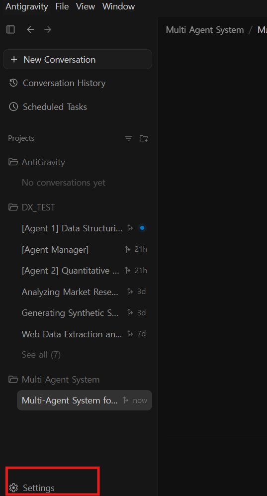
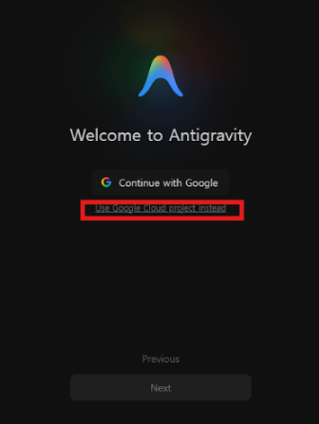

# 실습 0. Antigravity 설치 및 Google Cloud 연동

이 문서는 Antigravity 데스크톱 앱(GUI)을 설치하고 실행하는 절차입니다.

> 이번 수업은 **Antigravity 2.0 데스크톱 앱(GUI)** 으로 진행합니다. 구버전 Antigravity IDE(코드 편집기 형태)가 아닙니다. 두 앱은 아이콘으로 구분할 수 있습니다 — 2.0은 흰 배경, 구 IDE는 검은 그리드 배경입니다.

## 시작 전: 나는 어느 경로인가?

수업 구성에 따라 두 가지 경로가 있습니다. 어떤 실습까지 할지에 따라 필요한 설치가 다릅니다.

| 구분 | 경로 A — Antigravity만 | 경로 B — Cloud Run 배포까지 |
|---|---|---|
| 해당하는 경우 | 에디터·코딩 에이전트만 쓰면 됨. Google Cloud(GCP)에 뭔가 올리거나 호출할 일이 없음 | 만든 AI 앱을 Cloud Run에 배포하거나, 코드가 Vertex AI 등 GCP 서비스를 호출함 (**04 실습 포함**) |
| 필요한 것 | Antigravity 앱 로그인만 | 앱 로그인 + 로컬 ADC 인증 파일 (gcloud CLI로만 생성 가능) |
| 절차 | 1단계 설치 → 7단계 로그인만 | 아래 전체 절차 수행 |

**용어 설명**

- **GCP(Google Cloud Platform)**: Google의 클라우드 서비스. 내 컴퓨터가 아닌 Google의 서버를 빌려 프로그램을 돌리는 곳입니다. 회사/조직 단위로 "프로젝트"를 만들어 사용합니다.
- **gcloud CLI**: GCP를 터미널 명령으로 조작하는 공식 도구입니다.
- **ADC(Application Default Credentials)**: 내 컴퓨터에서 실행되는 프로그램이 "나는 이 Google 계정의 권한으로 일한다"고 증명할 때 쓰는 **로컬 인증 파일**입니다. 브라우저 로그인과 별개이며, gcloud CLI로만 만들 수 있습니다. 04 실습에서 에이전트가 내 권한으로 Cloud Run에 배포하려면 이 파일이 필요합니다.

---

## 1. Antigravity 설치

1. https://antigravity.google 에 접속해 **Download**를 누릅니다.
2. 운영체제(Windows / macOS / Linux)에 맞는 설치 파일을 받아 실행합니다.
3. 설치가 끝나면 앱을 실행합니다. 로그인 화면이 나오면 **아직 로그인하지 마세요.**
   - 경로 A라면 → 바로 [7단계 로그인](#7-antigravity-로그인)으로 이동
   - 경로 B라면 → 아래 2단계부터 계속

> 이미 Antigravity에 로그인되어 있다면 6단계에서 로그아웃 후 다시 로그인하게 되므로 그대로 진행하면 됩니다.

## 2. gcloud CLI 설치 (Windows 기준)

> ⚠️ gcloud CLI가 **이미 설치되어 있다면 삭제 후 재설치**가 필요합니다. 아래 [기존 설치 삭제](#참고-기존-gcloud-설치-삭제) 참고.

PowerShell(Windows 기본 터미널)을 열고 아래 명령을 복사해 붙여넣고 Enter를 누릅니다. 설치 프로그램 다운로드 페이지가 열립니다.

```powershell
Start-Process https://dl.google.com/dl/cloudsdk/channels/rapid/GoogleCloudSDKInstaller.exe
```


다운로드된 **Google Cloud CLI 설치 파일**을 실행합니다.



설치 중 추가 옵션은 건드릴 필요 없이 계속 **Next**를 클릭합니다.





> **macOS 사용자**: 터미널에서 `brew install --cask google-cloud-sdk` 또는 [공식 설치 문서](https://cloud.google.com/sdk/docs/install)를 따르세요. 이후 단계는 동일합니다.

### 참고: 기존 gcloud 설치 삭제

이전에 gcloud를 설치한 적이 있다면 제어판에서 삭제 후 다시 설치합니다.



제어판 → 프로그램 → **Google Cloud SDK** 삭제 → 위 절차로 재설치.



## 3. 설치 마지막 질문 답변

설치 마지막에 터미널 창이 열리며 두 가지 질문이 나옵니다.



- **1차 질문** (로그인하시겠습니까?): `y` 입력 → 브라우저가 열리면 Google 계정으로 로그인
- **2차 질문**: `n` 입력

## 4. 인증 명령 실행

PowerShell을 **완전히 종료했다가 다시 열고**(설치 직후에는 명령을 인식하지 못할 수 있습니다), 아래 두 명령을 **한 줄씩 차례로** 입력합니다.

```powershell
gcloud auth login
```

```powershell
gcloud auth application-default login
```

각 명령마다 브라우저가 열리고 Google 계정 로그인/동의 화면이 나옵니다. 첫 번째 명령은 gcloud CLI 자체의 로그인이고, 두 번째 명령이 바로 **ADC 인증 파일을 만드는** 명령입니다.



## 5. Antigravity 로그아웃 (기존 로그인이 있는 경우)

Antigravity에 이미 로그인되어 있었다면 설정에서 **Sign Out** 합니다.



## 6. ~ 7. Antigravity 로그인

다시 로그인 화면으로 돌아옵니다. **중요: "Continue with Google" 버튼을 누르지 말고**, 그 아래의 **"Use Google Cloud project instead"** 링크를 클릭합니다.



이후 안내에 따라 **GCP 프로젝트 ID**를 입력합니다 (수업에서 안내된 프로젝트 ID 사용).

> 왜 이렇게 로그인하나요? "Continue with Google"은 개인 계정 로그인입니다. GCP 프로젝트로 로그인하면 회사/조직의 Google Cloud 계약과 데이터 보호 정책(프롬프트·응답 미수집)이 적용되고, 사용료도 조직 프로젝트로 과금됩니다.

## 8. 문제 해결: 그래도 안 된다면

PowerShell에서 아래 명령을 입력해 환경 변수를 직접 지정한 뒤 Antigravity를 실행합니다. **프로젝트 ID는 본인 프로젝트에 맞게 바꿔야 합니다.**

```powershell
$env:GCP_PROJECT="my-project-40086"
$env:GCP_REGION="us-central1"
cd "$env:USERPROFILE\AppData\Local\Programs\antigravity"
.\antigravity.exe
```

## 9. 설치 확인

Antigravity가 정상 동작하는지 확인합니다.

1. 새 폴더를 하나 만들고(예: `바탕화면\antigravity-test`) Antigravity에서 그 폴더를 프로젝트로 엽니다.
2. 대화창에 입력: `이 폴더에 hello.txt 파일을 만들고 안에 "안녕하세요"라고 적어줘`
3. 에이전트가 파일을 만들면 폴더에서 직접 확인합니다.
4. (경로 B) 터미널 권한 확인: `gcloud config list를 실행해서 어떤 계정으로 로그인되어 있는지 알려줘` — 터미널 명령 승인 카드가 뜨면 내용을 읽고 승인해 봅니다.

여기까지 되면 설치 완료입니다.
