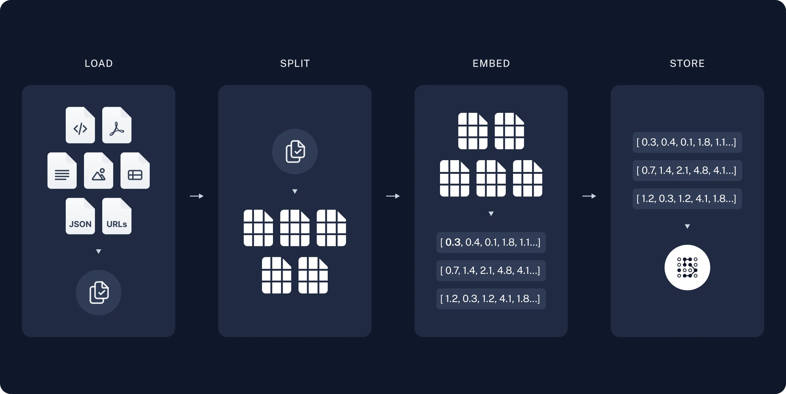
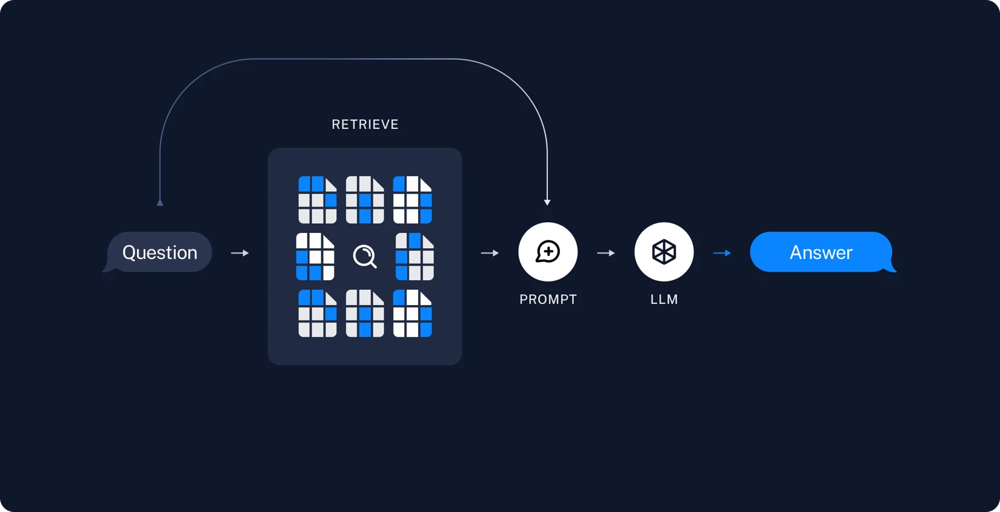
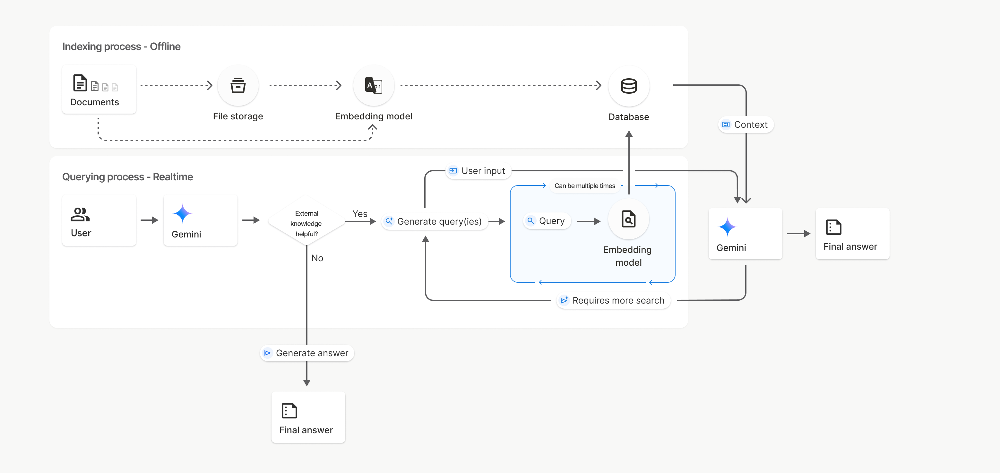

# 04 실습 맥락 설명: RAG, File Search, 그리고 Cloud Run

이 문서는 `README.md`의 따라하기 절차를 시작하기 전에 읽는 보충 설명입니다. 이번 실습은 이 과정에서 가장 "개발자스러운" 실습이지만, 개념을 잡고 나면 모든 단계가 에이전트와의 대화로 진행됩니다.

## 1. 문제 상황: AI는 우리 회사 문서를 모른다

Gemini에게 "우리 회사 출장비 규정 알려줘"라고 물으면 모릅니다. 당연합니다 — 모델은 인터넷의 공개 데이터로 학습됐고, 우리 회사 문서는 본 적이 없으니까요.

해결책으로 떠오르는 첫 방법은 "문서를 통째로 프롬프트에 붙여넣기"입니다. 문서 한두 개면 됩니다. 하지만 문서가 수십~수천 개라면? 02에서 배운 **컨텍스트 윈도우(단기 기억)의 한계** 때문에 다 넣을 수 없고, 넣을 수 있어도 매 질문마다 전체를 읽히는 비용이 큽니다.

그래서 나온 방식이 **RAG**입니다.

## 2. RAG 이해하기

**RAG(Retrieval-Augmented Generation, 검색 증강 생성)** 는 "AI가 답하기 전에, 질문과 관련된 문서 조각을 먼저 찾아서(검색) 그것을 참고해 답하게(생성) 하는" 방식입니다.

도서관 사서에 비유하면: 사서가 모든 책을 외우는 게 아니라, 질문을 받으면 **색인으로 관련 페이지를 찾아 펼쳐놓고** 답해주는 것과 같습니다. RAG는 두 단계로 나뉩니다.

### 2.1 단계 ① 인덱싱 — 문서를 검색 가능한 형태로 만들기 (사전 작업)



(다이어그램 출처: [LangChain RAG 튜토리얼](https://python.langchain.com/docs/tutorials/rag/))

1. **Load (불러오기)** — PDF, 워드 문서 등을 읽어 들입니다.
2. **Split (분할, 청킹)** — 문서를 적당한 크기의 조각(**청크, chunk**)으로 자릅니다. 통째로는 검색 단위가 너무 크기 때문입니다.
3. **Embed (임베딩)** — 각 청크를 **숫자 목록(벡터)** 으로 변환합니다. 임베딩이란 "글의 의미를 좌표로 표현하는 기술"입니다. 의미가 비슷한 글은 가까운 좌표를 갖습니다. 덕분에 "휴가 규정"으로 검색해도 "연차 사용 지침"이라는 청크를 찾을 수 있습니다 (단어가 아니라 **의미**로 검색).
4. **Store (저장)** — 이 벡터들을 전용 데이터베이스(**벡터 DB**)에 저장합니다.

### 2.2 단계 ② 검색과 생성 — 질문이 들어왔을 때 (실시간)



1. **Retrieve (검색)** — 사용자 질문도 벡터로 바꿔서, 저장된 청크 중 의미가 가까운 것들을 찾습니다.
2. **Generate (생성)** — 찾은 청크들을 질문과 함께 모델에게 주고 "이 자료를 근거로 답해"라고 시킵니다.

> 1일차의 GEMS "지식" 업로드도 사실 내부적으로 이런 일이 벌어지고 있던 것입니다. 이번 실습은 그 구조를 직접 만들어 보는 것입니다.

## 3. Google File Search — 관리형 RAG

### 3.1 직접 만들면 생기는 일

위 파이프라인을 직접 구축하려면 PDF 파서, 청킹 전략, 임베딩 모델, 벡터 DB 운영, 검색기, 프롬프트 조립까지 **여섯 가지 부품을 직접 고르고 연결하고 운영**해야 합니다. 개발팀이 있어도 부담스러운 일입니다.

**[Gemini File Search](https://ai.google.dev/gemini-api/docs/file-search)** 는 이 전부를 Gemini API 안으로 집어넣은 **관리형(managed) RAG**입니다. "관리형"이란 복잡한 내부 구조를 서비스 제공자가 대신 운영해 준다는 뜻입니다.



(다이어그램 출처: [Google 공식 문서](https://ai.google.dev/gemini-api/docs/file-search))

사용자가 하는 일은 단 두 가지입니다.

```python
# ① 업로드 — 청킹, 임베딩, 인덱싱이 자동으로 일어난다
op = client.file_search_stores.upload_to_file_search_store(
    file=path, file_search_store_name=store.name,
    config={"display_name": filename})

# ② 질문 — 검색과 생성이 한 번의 호출로 끝난다
response = client.models.generate_content(
    model="gemini-2.5-flash", contents=contents,
    config=types.GenerateContentConfig(tools=[
        types.Tool(file_search=types.FileSearch(
            file_search_store_names=[store.name]))]))
```

알아둘 개념과 특징:

- **File Search Store(스토어)** — 문서 인덱스를 담는 보관함. 일반 파일 업로드는 48시간 후 삭제되지만 스토어의 데이터는 삭제할 때까지 유지됩니다.
- **출처 추적(citation)** — 응답에 "이 답의 이 부분은 어느 문서의 어느 청크에서 왔는지"(`grounding_metadata`)가 자동으로 붙습니다. "출처를 보여주는 사내 챗봇"을 만들 때 가장 큰 장점입니다.
- **업로드는 시간이 걸립니다** — 인덱싱이 끝날 때까지 문서당 수십 초씩 기다려야 합니다(완료 여부를 반복 확인하는 폴링 방식).
- 지원 형식: PDF, DOCX, XLSX, PPTX, TXT, Markdown, JSON, 각종 코드 파일 등. 문서당 최대 100MB.
- 한계: 청크가 어떻게 나뉘었는지 전체를 열람할 수 없고, 원본 파일을 다시 내려받을 수도 없습니다(스토어는 인덱스이지 저장소가 아님). 페이지 번호 기반 인용도 불가능합니다.

### 3.2 비용: 직접 구축과 비교

File Search의 요금 구조 ([공식 요금표](https://ai.google.dev/gemini-api/docs/pricing)):

| 항목 | 비용 |
|---|---|
| 스토리지 (문서 보관) | **무료** (무료 등급 1GB, 유료 등급 10GB~1TB 한도) |
| 인덱싱 시 임베딩 | **$0.15 / 100만 토큰** — 문서를 처음 올릴 때 1회만 |
| 질문 시 임베딩 | **무료** |
| 검색된 청크 | 모델 입력 토큰으로 과금 (일반 프롬프트와 동일 단가) |

감을 잡기 위한 계산: 논문 PDF 10편(약 33MB, 수십만 토큰)을 인덱싱하는 비용은 **수십 원 수준**이고, 한 번 내면 끝입니다. 이후에는 질문할 때마다 검색된 청크 분량(보통 수천 토큰)만 모델 사용료에 얹힙니다.

직접 구축과 비교하면:

| | File Search | 직접 구축 (벡터 DB) |
|---|---|---|
| 고정비 | 사실상 0 | 벡터 DB 월정액 — 데이터가 놓여 있는 동안 계속 (예: 관리형 서비스 기준 월 수십~수백 달러) |
| 구축 작업 | API 호출 2개 | 파서·청킹·임베딩·DB·검색기·프롬프트 조립 전부 |
| 운영 인력 | 불필요 | 필요 |
| 세밀한 제어 | 제한적 (청크 크기·검색 범위 정도만 설정 가능) | 전부 가능 (검색 알고리즘 튜닝, 페이지 인용 등) |

**결론**: 문서 수십~수천 개 규모의 사내 문서 Q&A, 출처 표시가 필요한 챗봇, 프로토타입이라면 File Search가 압도적으로 유리합니다. 검색 품질을 직접 튜닝해야 하는 대규모 서비스라면 직접 구축을 검토합니다.

## 4. Google Cloud 기초

실습 후반부에는 만든 챗봇을 **배포**합니다. 배포(deploy)란 내 컴퓨터에서만 도는 프로그램(localhost)을 **서버에 올려 다른 사람도 접속할 수 있게 만드는 일**입니다. 내 컴퓨터를 서버로 쓸 수도 있지만 24시간 켜둘 수 없으니, Google의 컴퓨터를 빌립니다 — 이것이 클라우드입니다.

### 4.1 Google Cloud의 대표 서비스

| 서비스 | 한 줄 소개 |
|---|---|
| **Compute Engine** | 가상 컴퓨터(VM)를 통째로 빌리기. 모든 것을 직접 제어, 모든 것을 직접 관리 |
| **Cloud Run** ✅ | 프로그램만 주면 서버 운영은 Google이 알아서. 접속이 없으면 0대, 몰리면 자동 증설 (**이번 실습에서 사용**) |
| **Cloud Storage** | 파일·이미지·백업을 담는 무제한 저장소 |
| **BigQuery** | 초대용량 데이터를 SQL로 분석하는 데이터 웨어하우스 |
| **Vertex AI** | Gemini를 포함한 AI 모델의 학습·배포·관리 플랫폼 |
| **IAM** | "누가, 무엇을, 어디까지" 할 수 있는지 정하는 권한 관리 (아래 4.4) |

### 4.2 gcloud CLI

**gcloud**는 Google Cloud를 터미널 명령으로 조작하는 공식 CLI입니다. 웹 콘솔에서 마우스로 10번 클릭할 일을 명령 한 줄로 처리합니다. 더 중요한 것은 — **명령이기 때문에 에이전트에게 시킬 수 있다**는 점입니다. 실습 0에서 이미 설치했습니다.

### 4.3 Cloud Run 배포는 어떻게 일어나나

배포 명령은 단 한 줄입니다.

```bash
gcloud run deploy my-chatbot --source .
```

`--source .`는 "현재 폴더의 소스 코드를 그대로 올려라"라는 뜻입니다. 뒤에서 일어나는 일 ([공식 문서](https://cloud.google.com/run/docs/deploying-source-code)):

1. 소스 코드가 Google로 업로드되고, **Cloud Build**(빌드 대행 서비스)가 코드를 **컨테이너 이미지**로 만듭니다.
   - **컨테이너**란 프로그램과 그 실행 환경(언어, 라이브러리, 설정)을 통째로 포장한 박스입니다. "내 컴퓨터에선 되는데 서버에선 안 돼요" 문제를 없애 줍니다.
2. 만들어진 이미지가 **Artifact Registry**(이미지 보관소)에 저장됩니다.
3. Cloud Run이 그 이미지를 실행하고 `https://...run.app` 주소를 발급합니다.

즉 한 줄 명령 뒤에서 서비스 세 개가 협업하지만, 우리는 알 필요 없이 결과 주소만 받으면 됩니다.

### 4.4 IAM — 권한 관리

**IAM(Identity and Access Management)** 은 Google Cloud의 권한 시스템입니다. 모든 권한은 세 요소로 정의됩니다: **누가(주체: 사용자/그룹/서비스 계정) + 무엇을(역할, role) + 어디에(리소스)**.

예: "`hong@company.com`(누가)에게 이 Cloud Run 서비스(어디에)의 호출 권한 `roles/run.invoker`(무엇을)를 준다."

01에서 배운 Antigravity의 권한 체계(Allow/Ask/Deny)가 "내 컴퓨터에서 에이전트가 뭘 할 수 있나"라면, IAM은 "클라우드에서 누가 뭘 할 수 있나"입니다.

### 4.5 IAP — 우리 회사 사람만 접속하게 하기

배포된 Cloud Run 주소는 기본 설정에 따라 **전 세계 누구나 접속 가능**할 수 있습니다. 사내 챗봇이라면 곤란하지요.

**IAP(Identity-Aware Proxy)** 는 서비스 앞에 세우는 **Google 로그인 검문소**입니다. 접속자에게 먼저 Google 계정 로그인을 요구하고, 허용된 사람만 통과시킵니다. Gemini 비즈니스 계정처럼 "특정 도메인(@company.com) 사용자만 접속"을 구현하는 표준 방법입니다.

Cloud Run에는 IAP가 직접 통합되어 있어서 배포 시 `--iap` 옵션 하나로 켤 수 있고, 누구를 통과시킬지는 IAM으로 정합니다 ([공식 문서](https://cloud.google.com/run/docs/securing/identity-aware-proxy-cloud-run)):

```bash
# 회사 도메인 전체 허용 — "@company.com 계정이면 누구나"
gcloud iap web add-iam-policy-binding \
  --member=domain:company.com \
  --role=roles/iap.httpsResourceAccessor \
  --region=REGION --resource-type=cloud-run --service=my-chatbot
```

`--member`를 `user:hong@company.com`(개인), `group:team@company.com`(그룹), `domain:company.com`(도메인 전체)으로 바꿔가며 범위를 정합니다.

## 5. Cloud Run vs Firebase

배포 이야기를 하면 꼭 나오는 비교입니다. **Firebase**는 Google의 앱 개발 플랫폼으로, 그중 Hosting(정적 웹사이트 호스팅)과 App Hosting(웹 프레임워크 호스팅)이 Cloud Run과 비교됩니다.

| 상황 | 선택 | 이유 |
|---|---|---|
| 정적 웹사이트 (HTML/CSS/JS만, 서버 로직 없음) | **Firebase Hosting** | 전 세계 캐시 서버(CDN) + 무료 SSL, 소규모 무료 |
| Next.js 같은 최신 웹 프레임워크 앱 | **Firebase App Hosting** | GitHub 연동 자동 배포, Firebase 로그인/DB와 통합 |
| 우리처럼 **API 서버, 챗봇 백엔드, 자유로운 구성** | **Cloud Run** | 어떤 언어든, IAP·사내망 연동 등 인프라 제어가 필요할 때 |

참고로 Firebase App Hosting도 내부적으로는 Cloud Run 위에서 돌아갑니다. Firebase는 "쉽고 통합된 포장", Cloud Run은 "원판"이라고 보면 됩니다. 사내 도구처럼 IAP 접근 제어가 필요한 경우는 Cloud Run이 정답에 가깝습니다.

## 6. 한 문장으로 정리

```text
RAG는 "검색해서 근거를 찾은 다음 답하게 하는" 방식이고,
File Search는 그 검색 파이프라인 전체를 Google이 대신 운영해 주는 관리형 RAG이며,
Cloud Run은 만든 챗봇을 한 줄 명령으로 세상에 공개하는 서버리스 배포 서비스,
IAP는 그 앞에 세우는 "우리 회사 사람만 통과" 검문소다.
```

이제 [README.md](README.md)의 실습 절차로 넘어가세요.
