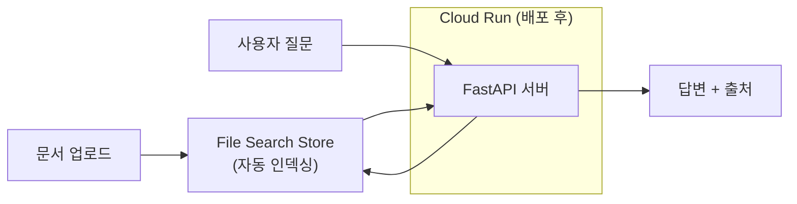

# 04. 실습 2: RAG 챗봇을 만들고 Cloud Run으로 배포하기

## 목표

Gemini File Search로 **문서를 업로드하면 그 문서를 근거로 출처와 함께 답하는 챗봇**을 만들고, Google Cloud Run에 배포해서 실제 URL로 접속 가능하게 만듭니다.

> 시작 전에 [CONCEPT_GUIDE.md](CONCEPT_GUIDE.md)를 반드시 먼저 읽으세요. RAG, File Search, Cloud Run, IAP가 무엇인지 모르면 아래 절차가 주문 외우기가 됩니다.

## 준비물

- [실습 0](../01_antigravity_basics/SETUP_GUIDE.md)의 **경로 B**까지 완료 (gcloud CLI + ADC 인증)
- **Gemini API 키** — [Google AI Studio](https://aistudio.google.com/apikey)에서 발급 (수업 중 안내)
- 실습용 문서 2~3개 (PDF, DOCX, TXT 등) — 사내 규정, 매뉴얼, 논문 등 **민감 정보 없는** 문서

> **API 키란?** 프로그램이 Gemini API를 호출할 때 쓰는 비밀번호입니다. 코드나 채팅에 그대로 붙여넣어 공유하면 안 되고, **환경 변수**(프로그램에 값을 전달하는 운영체제의 메모지)로 전달합니다.

## 전체 그림



## 1. 프로젝트 준비

1. 새 폴더를 만듭니다. 예: `rag-chatbot`
2. Antigravity에서 이 폴더를 프로젝트로 엽니다.

이번 실습은 에이전트에게 **단계별로** 시킵니다. 한 번에 "챗봇 만들고 배포까지 해줘"라고 던지지 않는 이유: 단계마다 결과를 확인해야 어디서 잘못됐는지 알 수 있고, 02에서 배운 대로 컨텍스트도 깔끔하게 유지되기 때문입니다.

> 막히면 이 저장소의 [`app/`](app/) 폴더에 참고용 완성본이 있습니다. 에이전트에게 "이 코드를 참고해"라고 줘도 되고, 그대로 복사해서 3단계(로컬 실행)부터 진행해도 됩니다.

## 2. 챗봇 구현 시키기

대화창에 입력:

```text
Gemini File Search API 기반 RAG 챗봇 웹 앱을 만들어줘.

기술 요구사항:
- Python + FastAPI, Gemini SDK는 google-genai 패키지 사용
- File Search Store는 display_name으로 찾고 없으면 만드는 get-or-create 방식
- POST /api/upload: 문서 파일을 받아 스토어에 업로드하고 인덱싱 완료까지 폴링
- POST /api/chat: 대화 히스토리와 질문을 받아 FileSearch 도구로 답변 생성.
  응답의 grounding_metadata에서 출처(문서 제목, 청크 텍스트)를 추출해 함께 반환
- 간단한 채팅 웹 화면 (문서 업로드 + 질문/답변 + 출처 표시)
- API 키는 GEMINI_API_KEY 환경 변수로만 받기 (코드에 하드코딩 금지)

주의사항:
- grounding_supports의 start/end_index는 문자 위치가 아니라 UTF-8 바이트 위치다.
  한글 답변에 인용 마커를 넣을 거면 바이트 단위로 처리할 것
- 최신 File Search 사용법은 https://ai.google.dev/gemini-api/docs/file-search 를 읽고 확인할 것

구현 계획을 먼저 보여주고 승인받은 후 진행해.
```

이 프롬프트에서 배울 점:

- **공식 문서 URL을 직접 줍니다.** 에이전트의 학습 데이터는 과거 시점이므로, 최신 API 사용법은 문서를 읽게 하는 것이 정확합니다.
- **아는 함정을 미리 알려줍니다** (바이트 오프셋 문제). 함정 정보는 에이전트의 시행착오를 크게 줄입니다.
- **비밀(API 키) 취급 규칙을 명시합니다.** 말하지 않으면 코드에 박아넣는 경우가 있습니다.

## 3. 로컬에서 실행하고 테스트

```text
GEMINI_API_KEY 환경 변수를 설정한 상태로 이 앱을 localhost에서 실행해줘.
실행되면 브라우저로 열어서 화면이 뜨는지 확인해.
```

API 키 값 자체는 채팅에 쓰지 말고, 에이전트가 안내하는 방법(터미널에서 직접 입력 또는 `.env` 파일)으로 설정하세요.

서버가 뜨면 **직접** 테스트합니다:

1. 브라우저에서 `http://localhost:8000` 접속
2. 준비한 문서를 업로드 — 인덱싱에 문서당 수십 초가 걸립니다 (CONCEPT_GUIDE 3.1 참고)
3. 문서 내용에 대해 질문 → 답변에 출처가 붙는지 확인
4. **문서에 없는 내용**을 질문 → 모른다고 하는지, 지어내는지 확인
5. 후속 질문("그럼 그건 왜 그래?") → 대화 맥락이 유지되는지 확인

문제가 있으면 증상을 그대로 에이전트에게 전달합니다. 오류 메시지는 요약하지 말고 **복사해서 통째로** 붙여넣는 것이 가장 빠릅니다.

## 4. Cloud Run 배포

이제 localhost를 벗어나 실제 URL을 만듭니다.

```text
이 앱을 Google Cloud Run에 배포해줘.
- gcloud run deploy를 --source 방식으로 사용
- 리전은 asia-northeast3 (서울)
- GEMINI_API_KEY는 --set-env-vars로 전달 (값은 내가 터미널에서 직접 입력할게)
- 배포 과정에서 실행할 gcloud 명령을 실행 전에 하나씩 설명해줘
```

에이전트가 실행하는 명령은 대략 이렇습니다 (직접 입력해도 됩니다):

```bash
gcloud run deploy rag-chatbot \
  --source . \
  --region asia-northeast3 \
  --set-env-vars GEMINI_API_KEY=발급받은키 \
  --allow-unauthenticated
```

- 처음 실행하면 API 활성화(Cloud Build, Artifact Registry 등) 동의를 물어봅니다 → `y`
- 몇 분 후 `https://rag-chatbot-xxxx.run.app` 형태의 주소가 발급됩니다
- **옆 사람 휴대폰으로 접속해 보세요.** localhost와의 차이가 이것입니다 — 이제 인터넷의 누구나 접속할 수 있는 서비스입니다

> `--allow-unauthenticated`는 "누구나 접속 허용"이라는 뜻입니다. 실습 확인용이고, 다음 단계에서 잠급니다.

## 5. IAP로 접근 제한 (사내 서비스 만들기)

지금 챗봇은 주소만 알면 전 세계 누구나 쓸 수 있습니다. 회사 문서를 올린 챗봇이라면 사고입니다. CONCEPT_GUIDE 4.5에서 배운 **IAP(Google 로그인 검문소)** 를 켭니다.

```bash
# 1) 외부 공개를 끄고 IAP를 켠다
gcloud run services update rag-chatbot \
  --region asia-northeast3 \
  --no-allow-unauthenticated --iap

# 2) IAP가 서비스를 호출할 수 있게 권한 부여 (PROJECT_NUMBER는 본인 프로젝트 번호)
gcloud run services add-iam-policy-binding rag-chatbot \
  --region=asia-northeast3 \
  --member=serviceAccount:service-PROJECT_NUMBER@gcp-sa-iap.iam.gserviceaccount.com \
  --role=roles/run.invoker

# 3) 접속 허용 대상 지정 — 본인 계정부터
gcloud iap web add-iam-policy-binding \
  --member=user:본인이메일@gmail.com \
  --role=roles/iap.httpsResourceAccessor \
  --region=asia-northeast3 --resource-type=cloud-run --service=rag-chatbot
```

확인:

- 허용한 계정으로 접속 → Google 로그인 후 정상 사용
- 허용 안 된 계정(시크릿 창) → 차단 화면
- 회사 도메인 전체를 허용하려면 3번의 `--member`를 `domain:company.com`으로

이 패턴이 바로 "Gemini 비즈니스 계정처럼 우리 회사 사람만 쓰는 사내 AI 도구"의 기본 구조입니다.

> 조직(Organization) 없이 개인 GCP 프로젝트에서 IAP를 처음 켜는 경우, 콘솔에서 OAuth 동의 화면 설정이 먼저 필요할 수 있습니다. 수업에서는 강사 안내를 따르세요.

## 6. 확인 포인트

- [ ] 문서에 있는 내용을 물으면 **출처와 함께** 답하는가?
- [ ] 문서에 없는 내용을 물으면 모른다고 하는가?
- [ ] run.app 주소로 다른 기기에서 접속되는가?
- [ ] IAP를 켠 후, 허용된 계정만 접속되는가?
- [ ] (복습) 이 과정에서 비용이 드는 지점이 어디인지 설명할 수 있는가? (인덱싱 1회 + 질문당 토큰 + Cloud Run 사용량)

## 7. 정리(청소)

실습이 끝나면 과금 방지를 위해 정리합니다.

```bash
# Cloud Run 서비스 삭제
gcloud run services delete rag-chatbot --region asia-northeast3
```

File Search 스토어도 에이전트에게 부탁해 삭제할 수 있습니다: "File Search 스토어 목록을 보여주고, rag-chatbot-store를 삭제해줘."

## 8. 응용 아이디어

- 사내 규정집 챗봇: 인사/총무 규정 PDF를 올리고 IAP로 회사 도메인만 허용
- 제품 매뉴얼 봇: 고객센터 FAQ 문서 기반 응대 초안 생성
- 회의록 검색 봇: 매주 회의록을 업로드해 "그 결정 언제 했더라?"에 답하기
