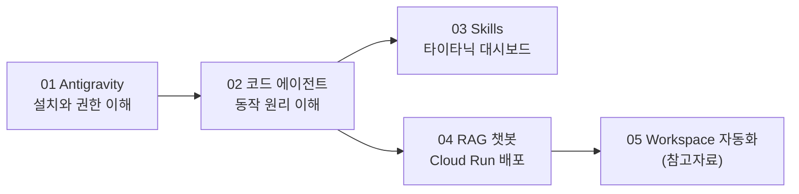

# Antigravity 기반 바이브 코딩 실습 (2일차)

이 폴더는 수업 중 학생들이 직접 열어보고 따라 할 실습 자료입니다.

1일차에는 코드를 거의 쓰지 않고 Gemini, GEMS, Google Sheets, Apps Script, AppSheet로 업무를 자동화했습니다.
2일차에는 한 단계 더 나아가 **코드 에이전트(AI가 코드를 대신 작성하고 실행해 주는 도구)** 를 사용합니다.

직접 코드를 한 줄씩 작성하는 것이 아니라, **원하는 것을 말로 설명하면 AI 에이전트가 코드를 만들고, 사람은 결과를 검토하는 방식**으로 일합니다. 이런 작업 방식을 흔히 "바이브 코딩(vibe coding)"이라고 부릅니다.

## 실습 순서

| 번호 | 폴더 | 목표 |
|---|---|---|
| 01 | `01_antigravity_basics` | Antigravity가 무엇인지 이해하고, 설치하고, 권한 체계를 익히기 |
| 02 | `02_code_agent_context` | 코드 에이전트가 일하는 원리(프로젝트, 컨텍스트 윈도우) 이해하기 |
| 03 | `03_frontend_skills` | Skills를 활용해 타이타닉 데이터 대시보드 만들기 |
| 04 | `04_rag_cloud_run` | 문서 기반 RAG 챗봇을 만들고 Cloud Run으로 배포하기 |
| 05 | `05_workspace_automation` | (참고자료) Google Workspace를 코드/CLI로 자동화하는 방법 |

## 전체 흐름

## 폴더 구성 안내

각 폴더는 보통 두 종류의 문서로 이루어져 있습니다.

- `CONCEPT_GUIDE.md` — 실습을 시작하기 전에 읽는 배경 설명입니다. "내가 지금 무엇을 하려는 건지", "이 기술이 왜 필요한지"를 다룹니다.
- `README.md` — 실제로 따라 하는 실습 절차입니다.

실습 중 막히면 먼저 해당 폴더의 `CONCEPT_GUIDE.md`를 다시 읽어보세요. 대부분의 막힘은 "지금 어느 단계에 있는지"를 놓쳐서 생깁니다.

## 준비물

- Google 계정 (Antigravity 로그인용)
- Antigravity 데스크톱 앱 — 설치 방법은 [01_antigravity_basics/SETUP_GUIDE.md](01_antigravity_basics/SETUP_GUIDE.md)
- 04 실습은 Google Cloud 프로젝트와 Gemini API 키가 필요합니다 (수업 중 안내)

## 주의사항

- 실습 데이터는 공개 데이터를 사용합니다.
- 사내 데이터로 실습할 때는 개인정보와 민감 정보를 반드시 제거하거나 마스킹하세요.
- 코드 에이전트는 파일을 만들고 지우고 명령어를 실행할 수 있는 도구입니다. **권한 요청이 뜨면 무엇을 허용하는 건지 읽고 승인하는 습관**이 이번 수업에서 가장 중요합니다.
- Antigravity는 빠르게 업데이트되는 제품입니다. 화면 구성이 이 자료의 스크린샷과 조금 다를 수 있습니다. 이 자료는 2026년 6월 기준으로 작성되었습니다.
