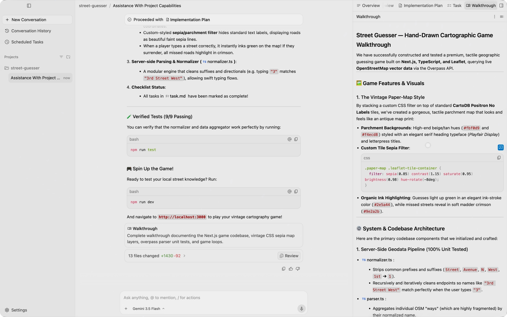
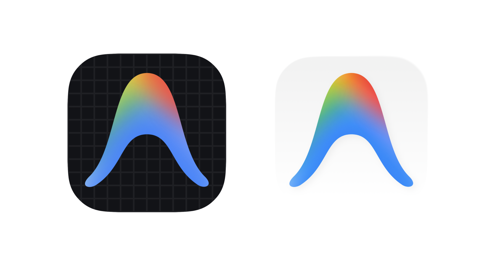
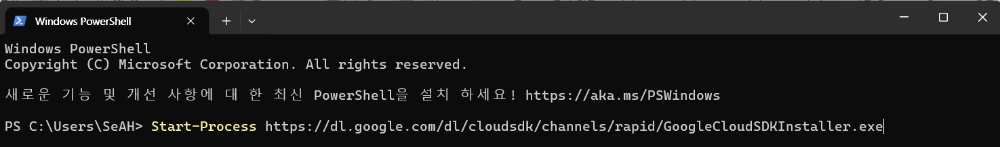
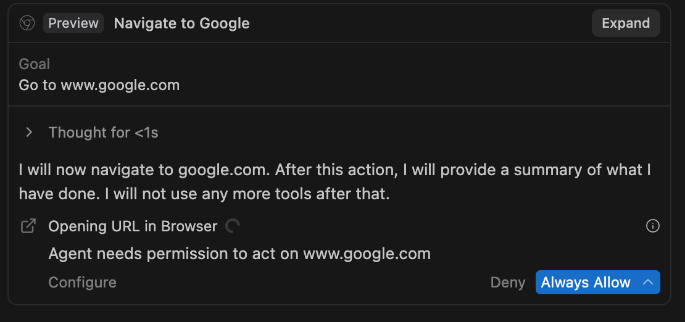
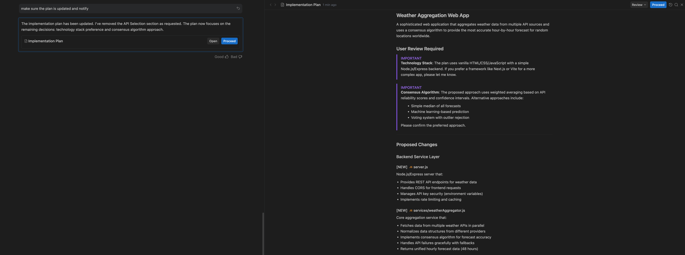
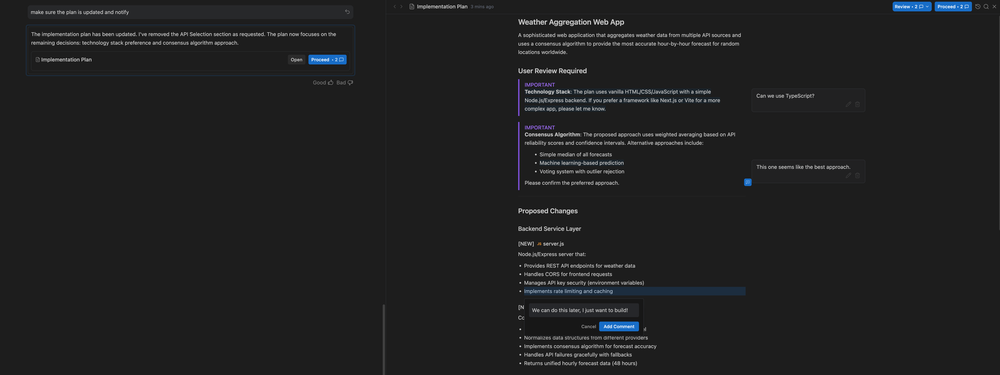
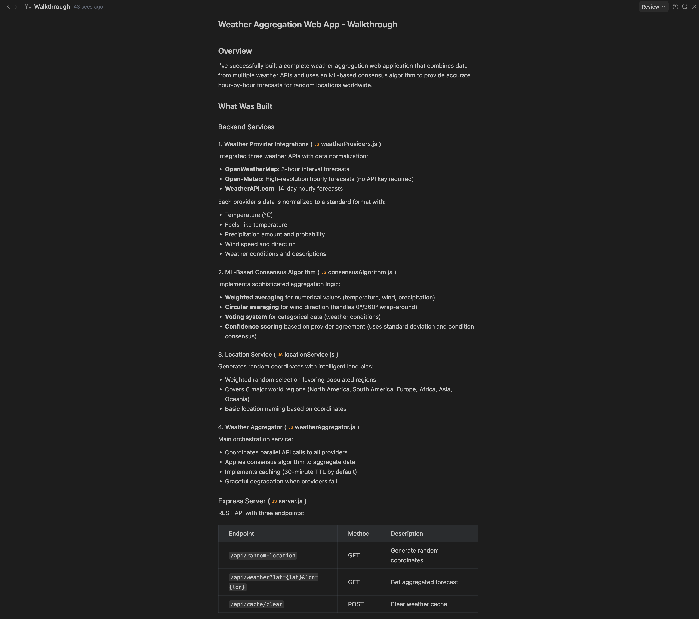
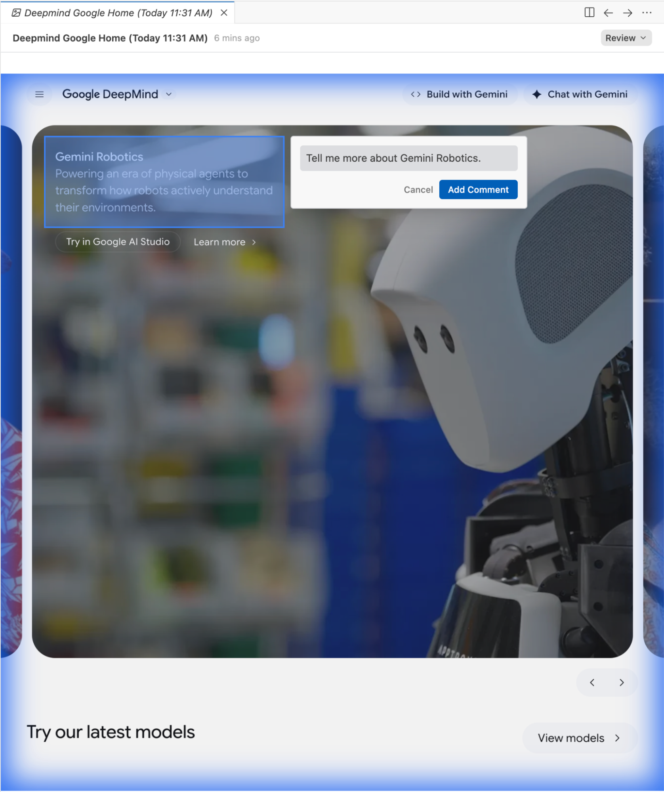
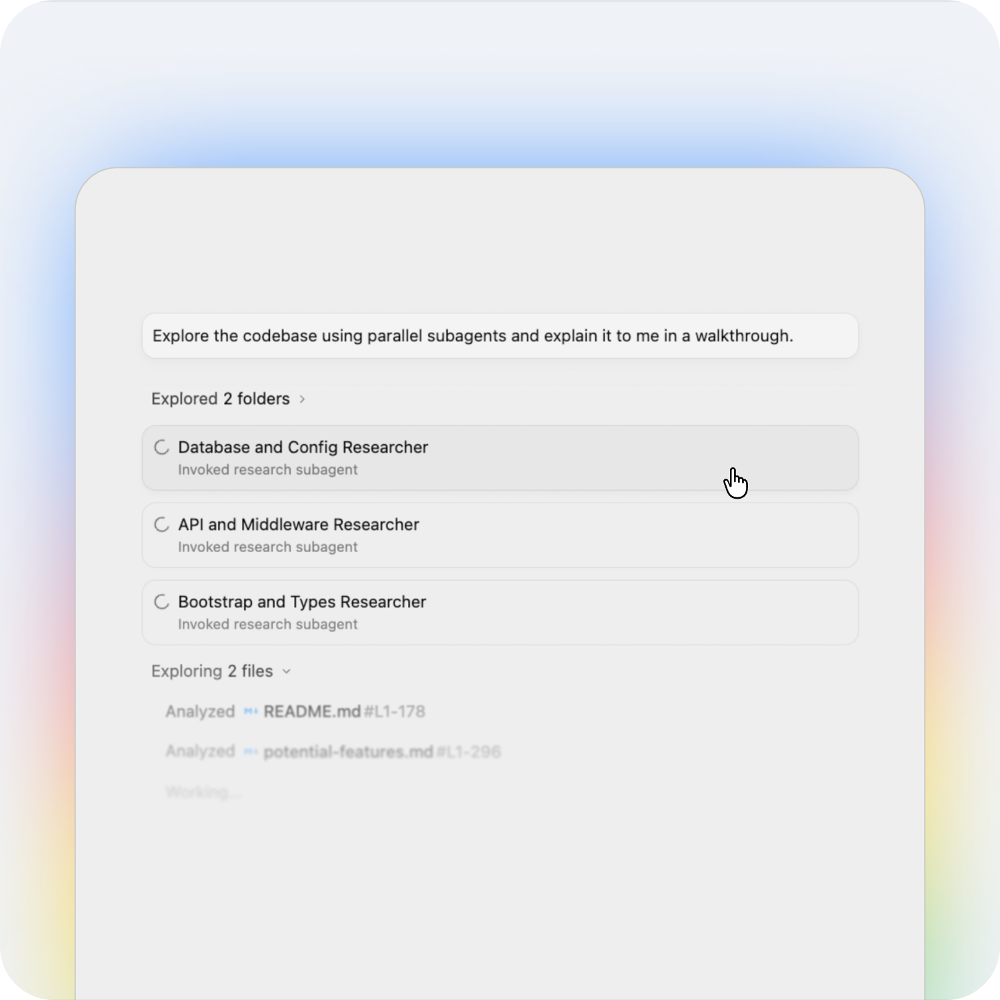
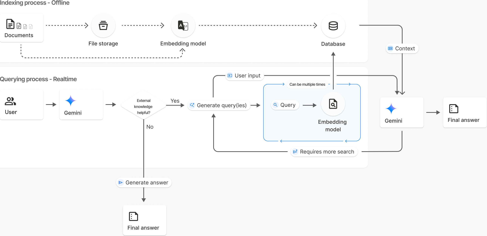

<div class="cover-telemetry"><span>DAY 02 · MISSION SHEET</span><span>실습 4종 · 2026-06</span></div>

<div class="title-block">
<div class="latin-mark">ANTIGRAVITY</div>

# 코드를 몰라도,<br>오늘부터 <em>에이전트</em>를 부립니다

<p class="cover-sub">Google Antigravity로 배우는 바이브 코딩 — 설치와 권한부터 RAG 챗봇의 Cloud Run 배포까지</p>
</div>

<div class="cover-foot"><span>github.com/cozytk/google-antigravity-practice</span><span>GOOGLE WORKSPACE × AI 과정</span></div>

---

<p class="eyebrow">FLIGHT PLAN · 오늘의 비행 계획</p>

# 어제는 도구 <em>안에서</em>, 오늘은 도구를 <em>부립니다</em>

<p class="thesis">1일차: Gems · Sheets · Apps Script — 정해진 도구 안의 자동화. 2일차: 에이전트에게 목표를 주고 결과를 검토하는 방식.</p>

| 모듈 | 내용 | 실습 |
|---|---|---|
| M1 | Antigravity 이해와 설치 — 에이전트, 권한, 계정 | 실습 0 · 설치와 GCP 연동 |
| M2 | 에이전트의 머릿속 — 프로젝트와 컨텍스트 윈도우 | 이론 |
| M3 | Skills — 에이전트에게 전문성 장착하기 | 실습 1 · 타이타닉 대시보드 |
| M4 | RAG와 배포 — File Search, Cloud Run, IAP | 실습 2 · 사내 문서 챗봇 |
| M5 | Workspace 자동화 — `gws`와 API | 참고자료 |

<p class="note"><b>VIBE CODING</b> 원하는 것을 말로 설명하면 AI가 코드를 만들고, 사람은 결과를 검토하는 작업 방식. 오늘의 모든 실습이 이 방식입니다.</p>

---
class: divider
---

<p class="div-no">M1</p>

## Antigravity 이해와 설치

<p class="div-sub">에이전트 관제 센터에 입장하기 — 챗봇과 에이전트의 차이, 권한 체계, 실습 0</p>

<p class="div-file">01_antigravity_basics/</p>

---

<p class="eyebrow">M1 · ANTIGRAVITY BASICS</p>

# 챗봇과 <em>에이전트</em>는 다릅니다

<div class="vs">
<div class="pane">
<h3><span class="latin">CHATBOT</span>Gemini 웹 채팅</h3>
<p>한 번 묻고 한 번 답합니다. 결과물은 텍스트 답변이고, 내 컴퓨터에는 접근할 수 없습니다.</p>
<p>사람의 역할: 질문하기.</p>
</div>
<i class="vs-badge">VS</i>
<div class="pane key">
<h3><span class="latin">AGENT</span>코드 에이전트</h3>
<p>목표를 주면 계획 → 실행 → 검증을 스스로 반복합니다. 내 컴퓨터에서 파일을 만들고, 터미널 명령을 실행하고, 브라우저를 조작합니다.</p>
<p>사람의 역할: 목표 제시, 계획 승인, 결과 검토.</p>
</div>
</div>

| | 챗봇 | 에이전트 |
|---|---|---|
| 결과물 | 텍스트 답변 | 실제 파일, 실행되는 프로그램 |
| 내 컴퓨터 접근 | 불가 | 파일 읽기/쓰기 · 명령 실행 · 브라우저 조작 |

---

<p class="eyebrow">M1 · ANTIGRAVITY BASICS</p>

# Antigravity — 에이전트들의 <em>관제 센터</em>

<div class="split">
<div>

<p class="thesis">Google의 에이전트 우선(agent-first) 플랫폼. 공식 표현은 "AI 에이전트들의 중앙 관제 센터(central command center)".</p>

<div class="deflist narrow">
<div><b>직접 일한다</b><span>코드 작성, 터미널 실행, 웹 브라우저 조작까지 에이전트가 수행</span></div>
<div><b>보고서로 말한다</b><span>계획서·작업 요약 같은 산출물(Artifacts)로 진행 상황을 보고</span></div>
<div><b>사람은 관제사</b><span>목표를 주고, 계획을 승인하고, 결과를 검토</span></div>
</div>

</div>
<div>
<figure class="shot">

<figcaption>Antigravity 2.0의 에이전트 우선 레이아웃 (공식 블로그)</figcaption>
</figure>
</div>
</div>

---

<p class="eyebrow">M1 · ANTIGRAVITY BASICS</p>

# 관제의 4원칙 — 일일이 보지 말고, <em>보고받으세요</em>

<p class="thesis">에이전트의 모든 키 입력을 지켜볼 수는 없습니다. Antigravity의 협업 철학 네 가지.</p>

<div class="quad">
<div class="pane">
<h3><span class="latin">TRUST</span>신뢰</h3>
<p>행동을 실시간 감시하는 대신, 검증하기 쉬운 산출물(계획서·보고서)로 보고받습니다.</p>
</div>
<div class="pane">
<h3><span class="latin">AUTONOMY</span>자율성</h3>
<p>도구와 권한을 충분히 주고 여러 단계를 스스로 진행하게 합니다.</p>
</div>
<div class="pane">
<h3><span class="latin">FEEDBACK</span>피드백</h3>
<p>Google Docs에 댓글 달듯, 산출물 위에 코멘트를 남겨 수정시킵니다.</p>
</div>
<div class="pane">
<h3><span class="latin">SELF-IMPROVE</span>자가개선</h3>
<p>승인한 권한과 피드백이 쌓여 점점 내 방식에 맞게 일합니다.</p>
</div>
</div>

<p class="note"><b>SOURCE</b> 출시 블로그 · antigravity.google/blog/introducing-google-antigravity</p>

---

<p class="eyebrow">M1 · ANTIGRAVITY BASICS</p>

# 이름이 셋 — 오늘 타는 기체는 <em>2.0</em>

<div class="split">
<div>

| 구분 | 형태 | 출시 |
|---|---|---|
| Antigravity IDE | 데스크톱 IDE (구버전) | 2025.11 |
| **Antigravity 2.0** | **독립 GUI 앱** | 2026.05 |
| Antigravity CLI | 터미널 앱 `agy` | 2026.05 |

<div class="deflist narrow">
<div><b>IDE</b><span>코드 편집기(VS Code 계열) 안에 에이전트가 들어 있는 형태</span></div>
<div><b>2.0 ✓</b><span>IDE 없이 에이전트 대화와 산출물 검토가 중심인 데스크톱 앱</span></div>
<div><b>CLI</b><span>같은 엔진을 터미널에서 — 설정·권한이 2.0과 자동 동기화</span></div>
</div>

</div>
<div>
<figure class="shot">

<figcaption>구분법 — 흰 배경 아이콘이 2.0, 검은 그리드가 구 IDE</figcaption>
</figure>
<p class="thesis">Gemini CLI도 Antigravity CLI로 통합 진행 중 — 첫 실행 시 기존 설정을 자동으로 가져옵니다.</p>
</div>
</div>

---

<p class="eyebrow">M1 · 실습 0 · SETUP_GUIDE.md</p>

# 실습 0 — 설치 전, 내 <em>경로</em>부터 고르세요

<div class="vs">
<div class="pane">
<h3><span class="latin">PATH A</span>Antigravity만 쓴다</h3>
<p>에이전트로 코딩만 하면 됨. Google Cloud를 호출할 일 없음.</p>
<p>→ 앱 설치 후 로그인만 하면 끝.</p>
</div>
<i class="vs-badge">VS</i>
<div class="pane key">
<h3><span class="latin">PATH B</span>Cloud Run 배포까지</h3>
<p>만든 앱을 배포하거나 코드가 GCP를 호출함 — <strong>오늘 실습 2가 여기 해당.</strong></p>
<p>→ 앱 로그인 + <code>gcloud</code> CLI + ADC 인증 파일까지 필요.</p>
</div>
</div>

<p class="note"><b>WHY</b> 경로 B에 새 용어가 셋 나옵니다 — 다음 장에서 먼저 정리하고 갑니다.</p>

---

<p class="eyebrow">M1 · 실습 0 · 용어 정리</p>

# 경로 B의 <em>세 단어</em>부터

<div class="deflist">
<div><b>GCP</b><span>Google Cloud Platform — 내 컴퓨터가 아닌 Google의 서버를 빌려 프로그램을 돌리는 클라우드 서비스. 회사/조직 단위로 "프로젝트"를 만들어 사용합니다.</span></div>
<div><b>gcloud CLI</b><span>GCP를 터미널 명령으로 조작하는 공식 도구. 웹 콘솔에서 마우스로 10번 클릭할 일을 명령 한 줄로 처리합니다.</span></div>
<div><b>ADC</b><span>Application Default Credentials — 내 컴퓨터의 프로그램이 "나는 이 Google 계정의 권한으로 일한다"고 증명하는 로컬 인증 파일. 브라우저 로그인과 별개이며, gcloud CLI로만 만들 수 있습니다.</span></div>
</div>

<p class="note"><b>POINT</b> 실습 2에서 에이전트가 내 권한으로 Cloud Run에 배포하려면 ADC 파일이 반드시 필요합니다 — 그래서 실습 0에서 미리 만듭니다.</p>

---
class: compact
---

<p class="eyebrow">M1 · 실습 0 · 설치 시퀀스</p>

# 설치는 <em>다섯 단계</em> — Windows 기준

<div class="timeline">
<div><b>Antigravity 앱 설치</b><span>antigravity.google에서 다운로드. 로그인 화면이 나오면 <strong>아직 로그인하지 않기</strong></span></div>
<div><b>gcloud CLI 설치</b><span>PowerShell에서 다운로드 명령 실행 → 설치 중 옵션 없이 계속 Next. 기존 설치가 있다면 제어판에서 삭제 후 재설치</span></div>
<div><b>설치 마지막 두 질문</b><span>1차 질문(로그인하시겠습니까?) → <code>y</code> 입력 후 브라우저 로그인 · 2차 질문 → <code>n</code></span></div>
<div><b>PowerShell 재시작 후 인증 두 명령</b><span><code>gcloud auth login</code> → <code>gcloud auth application-default login</code> — 두 번째 명령이 ADC 파일을 만듭니다</span></div>
<div><b>Antigravity 다시 로그인</b><span>기존 로그인이 있으면 Sign Out 후, <strong>"Use Google Cloud project instead"</strong>로 — 다음 장</span></div>
</div>

<p class="note"><b>MACOS</b> 터미널에서 <code>brew install --cask google-cloud-sdk</code> 후 4단계부터 동일.</p>

---

<p class="eyebrow">M1 · 실습 0 · 화면으로 보기</p>

# 따라가며 보게 될 <em>세 화면</em>

<div class="shot-row three">
<figure class="shot">

<figcaption>② PowerShell에서 설치 파일 다운로드 명령 실행</figcaption>
</figure>
<figure class="shot">

<figcaption>③ 설치 마지막 질문 — 1차 y, 2차 n</figcaption>
</figure>
<figure class="shot">

<figcaption>④ 인증 명령 실행 — 브라우저가 열리며 로그인</figcaption>
</figure>
</div>

```powershell
Start-Process https://dl.google.com/dl/cloudsdk/channels/rapid/GoogleCloudSDKInstaller.exe
```

---

<p class="eyebrow">M1 · 실습 0 · 로그인</p>

# 가장 틀리기 쉬운 한 곳 — <em>로그인 방식</em>

<div class="split">
<div>

<p class="thesis"><strong>"Continue with Google"을 누르지 마세요.</strong> 그 아래의 작은 링크가 정답입니다.</p>

<div class="deflist narrow">
<div><b>개인 로그인</b><span>Continue with Google — 개인 계정. 입력 데이터가 모델 개선에 쓰일 수 있음</span></div>
<div><b>프로젝트 로그인 ✓</b><span>Use Google Cloud project instead → GCP 프로젝트 ID 입력. 조직의 데이터 보호 정책·과금이 적용됨</span></div>
</div>

<p class="note"><b>CHECK</b> 새 폴더를 프로젝트로 열고 "hello.txt 만들어줘"가 동작하면 설치 완료. 안 되면 PowerShell에서 <code>$env:GCP_PROJECT</code> 환경 변수 지정 후 재실행 (교안 8절).</p>

</div>
<div>
<figure class="shot">

<figcaption>⑤ 빨간 박스의 링크로 로그인 — GCP 프로젝트 ID는 수업 중 안내</figcaption>
</figure>
</div>
</div>

---

<p class="eyebrow">M1 · PERMISSIONS</p>

# 권한은 <em>신호등</em>입니다 — Deny · Ask · Allow

<div class="trio">
<div class="pane">
<h3><i class="sig nogo">NO-GO · Deny</i></h3>
<p>무조건 차단. 예: 폴더 통째 삭제 명령.</p>
</div>
<div class="pane">
<h3><i class="sig hold">HOLD · Ask</i></h3>
<p>실행 전에 승인 카드로 물어봄. <strong>설정 안 한 모든 동작의 기본값.</strong></p>
</div>
<div class="pane">
<h3><i class="sig go">GO · Allow</i></h3>
<p>자동 승인. 같은 대상이 겹치면 우선순위는 Deny &gt; Ask &gt; Allow.</p>
</div>
</div>

| 기본 동작 | 신호 |
|---|---|
| 프로젝트 폴더 **안** 파일 읽기/쓰기 | GO — 에이전트의 작업 책상이므로 자유 |
| 터미널 명령 · 폴더 **밖** 파일 · MCP | HOLD — 매번 승인 카드 |
| 웹/네트워크 접근 | HOLD — 프로젝트에서 `*` 허용 전까지 매번 물어봄 |

<p class="note"><b>HABIT</b> 오늘 수업에서 가장 중요한 습관 — 승인 카드가 뜨면 무엇을 허용하는지 읽고 승인하기.</p>

---

<p class="eyebrow">M1 · PERMISSIONS</p>

# 권한이 적용되는 <em>여섯 동작</em>

<p class="thesis">모든 민감한 동작은 <code>동작(대상)</code> 형식으로 관리되고, 어디든 <code>*</code>(전부) 와일드카드를 쓸 수 있습니다 — 예: <code>read_url(*)</code> = 모든 웹사이트 읽기 허용.</p>

<div class="deflist">
<div><b>read_file / write_file</b><span>파일 읽기 / 쓰기 — 쓰기를 허용하면 읽기는 자동 허용, 읽기를 거부하면 쓰기도 자동 거부</span></div>
<div><b>read_url</b><span>웹 페이지 읽기 — 네트워크는 따로 <code>read_url(*)</code>을 허용하지 않으면 도메인마다 물어봅니다</span></div>
<div><b>execute_url</b><span>웹 페이지에서 클릭, 입력 등 실제 조작</span></div>
<div><b>command</b><span>터미널 명령 실행 — 명령 패턴 단위로 허용/차단</span></div>
<div><b>mcp(서버/도구)</b><span>외부 연동 도구(MCP) 호출 — M2에서 MCP 설명</span></div>
</div>

---

<p class="eyebrow">M1 · PERMISSIONS</p>

# 권한은 두 층 — 글로벌 위에 <em>프로젝트</em>가 쌓입니다

<div class="duo">
<div class="pane">
<h3><span class="latin">GLOBAL</span>기본 권한</h3>
<p>모든 프로젝트 공통. 예: 어디서든 위험 명령은 Deny.</p>
</div>
<div class="pane">
<h3><span class="latin">PROJECT</span>프로젝트 권한</h3>
<p>글로벌을 상속 + 이 폴더만의 허용 추가. 대화 중 승인한 권한은 저장되어 다음부터 안 물어봅니다 — 쓸수록 학습되는 구조.</p>
</div>
</div>

<div class="duo">
<div class="pane">
<h3><span class="latin">SANDBOX</span>샌드박스 모드</h3>
<p>터미널 명령을 모래 놀이터처럼 격리된 공간에서 실행. 파일 권한이 접근 목록으로, <code>read_url</code> 도메인이 네트워크 허용 목록으로 그대로 적용 — 권한 설정 하나로 일관 통제.</p>
</div>
<div class="pane">
<h3><span class="latin">AUTO-EXEC</span>터미널 자동 실행 정책</h3>
<p><strong>Request Review</strong>(허용 목록 외 전부 승인 요청 — 수업 권장) vs Always Proceed(차단 목록 외 자동 실행).</p>
</div>
</div>

---

<p class="eyebrow">M1 · PERMISSIONS</p>

# 웹 접근은 <em>2중 검문</em> — Denylist + Allowlist

<div class="split">
<div>

<div class="deflist narrow">
<div><b>Denylist</b><span>Google 서버가 관리하는 악성 URL 차단 목록 — 항상 우선 적용</span></div>
<div><b>Allowlist</b><span>내가 관리하는 허용 목록 — 초기값은 <code>localhost</code>(내 컴퓨터)뿐</span></div>
</div>

<p class="thesis">허용 안 된 URL에 접근하려 하면 오른쪽 같은 확인 창이 뜹니다. "Always allow"를 누르면 그 도메인이 허용 목록에 추가됩니다.</p>

<p class="note"><b>RULE</b> 실습 중 이 창이 뜨면 — 도메인을 읽고, 의도한 사이트가 맞을 때만 허용.</p>

</div>
<div>
<figure class="shot">

<figcaption>미허용 URL 접근 시 확인 창 (공식 문서)</figcaption>
</figure>
</div>
</div>

---

<p class="eyebrow">M1 · ARTIFACTS</p>

# 에이전트는 <em>보고서</em>로 말합니다 — Artifacts

<div class="split">
<div>

<p class="quote">"Artifact는 에이전트가 자신의 진행 상황과 생각을 사람에게 보고하기 위해 만드는 구조화된 산출물이다."<span class="who">— 공식 문서 · antigravity.google/docs/artifacts</span></p>

<div class="chips"><i>작업 목록</i><i>구현 계획</i><i>작업 요약</i><i>스크린샷</i><i>브라우저 녹화</i></div>

<p class="thesis">수십 개 파일을 만지는 과정을 다 지켜보는 대신, <strong>검증하기 쉬운 보고서만 검토</strong>합니다 — 실무자의 키보드가 아니라 기획서와 결과 보고서를 보는 것처럼.</p>

</div>
<div>
<figure class="shot">

<figcaption>Implementation Plan — 코드를 고치기 전에 만드는 기술 계획서</figcaption>
</figure>
</div>
</div>

---

<p class="eyebrow">M1 · ARTIFACTS</p>

# 계획서엔 <em>코멘트</em>, 작업 후엔 <em>요약 보고</em>

<div class="shot-row">
<figure class="shot crop">

<figcaption>BEFORE — 계획서에 인라인 코멘트로 수정 지시, 승인은 Proceed 버튼</figcaption>
</figure>
<figure class="shot crop">

<figcaption>AFTER — Walkthrough: 무엇이 어떻게 바뀌었는지 요약 보고</figcaption>
</figure>
</div>

| 실행 모드 | 동작 | 언제 |
|---|---|---|
| Planning Mode | 계획서를 먼저 만들고 승인받은 후 실행 | 중요한 작업, 처음 해보는 작업 |
| Fast Mode | 계획 없이 즉시 실행 | 사소한 수정, 빠른 실험 |

---

<p class="eyebrow">M1 · BROWSER</p>

# 에이전트가 직접 <em>열어보고</em> 검증합니다

<div class="split">
<div>

<p class="thesis">에이전트는 Chrome을 조작해 자기가 만든 웹 페이지를 열고, 클릭하고, 스크린샷을 찍어 검증합니다. 그 증거가 아티팩트로 남습니다.</p>

<div class="deflist narrow">
<div><b>격리 프로필</b><span>내 브라우저와 분리된 별도 Chrome 프로필 사용 — 내 로그인·쿠키에 접근 불가</span></div>
<div><b>/browser</b><span>브라우저 사용을 명시적으로 시키는 슬래시 명령</span></div>
<div><b>녹화</b><span>브라우저 작업 과정을 영상(webm)으로 남길 수 있음</span></div>
</div>

</div>
<div>
<figure class="shot">

<figcaption>브라우저 스크린샷이 아티팩트로 저장된 모습 (공식 문서)</figcaption>
</figure>
</div>
</div>

---

<p class="eyebrow">M1 · INTERFACE</p>

# 슬래시 명령과 <em>모델 선택</em>

<div class="split">
<div>

<div class="deflist narrow">
<div><b>/grill-me</b><span>구현 전에 에이전트가 나에게 역으로 질문 — 요구사항이 모호할 때 (grill = 꼬치꼬치 캐묻다)</span></div>
<div><b>/goal</b><span>목표가 달성될 때까지 멈추지 않고 실행-검증 반복</span></div>
<div><b>/schedule</b><span>에이전트 작업 예약 실행 — 매일 아침 보고서 생성 등</span></div>
<div><b>/browser</b><span>브라우저 사용을 명시적으로 트리거</span></div>
</div>

<div class="chips"><i>Dynamic Subagents</i><i>Scheduled Tasks</i><i>Voice 입력</i><i>JSON Hooks</i></div>
<p class="thesis">↑ 그 외 기능은 이름만 알아두면 됩니다.</p>

</div>
<div>
<figure class="shot">

<figcaption>입력창 아래 모델 선택 — Gemini 계열 외에 Claude 모델도 선택 가능</figcaption>
</figure>
</div>
</div>

---

<p class="eyebrow">M1 · ACCOUNT &amp; DATA</p>

# 회사에서 쓸 때 — 내 프롬프트는 <em>어디로</em> 가나

<div class="split">
<div>

| 계정 | 데이터 정책 |
|---|---|
| **Business / 조직** | 텔레메트리 비활성 — 프롬프트·코드·응답 **미수집**. 익명화된 사용 통계(기능 사용 여부 등)만 수집 |
| 개인 무료 | 설정에서 옵트아웃하지 않으면 입력이 모델 개선에 활용될 수 있음 |

<p class="quote">"기업의 프롬프트, 응답, 코드, 텔레메트리는 고객의 프라이빗 환경 밖에 저장되지 않습니다."<span class="who">— 기업용 공식 블로그</span></p>

</div>
<div>
<figure class="shot">

<figcaption>Business 계정 설정 — 텔레메트리 토글이 비활성화되어 있다</figcaption>
</figure>
</div>
</div>

---

<p class="eyebrow">M1 · PLANS</p>

# 요금제 — 무료로 시작해도 <em>충분</em>합니다

<div class="bigstat">
<div><i>FREE</i><b>₩0</b><span>Gemini + Claude 모델, 주간 한도 내 사용. 자동완성·Command 무제한</span></div>
<div><i>GOOGLE AI PRO</i><b>$20<small>/월</small></b><span>5시간마다 갱신되는 넉넉한 쿼터</span></div>
<div><i>GOOGLE AI ULTRA</i><b>$100~200<small>/월</small></b><span>Pro의 5~20배 한도, 최우선 쿼터</span></div>
<div class="hot"><i>ORGANIZATION</i><b>사용량 과금</b><span>Google Cloud 경유 — 데이터 보호 정책 적용, 조직 프로젝트로 과금</span></div>
</div>

<p class="note"><b>RULE</b> 회사 업무 데이터는 반드시 회사 계정(조직 플랜) 정책 아래에서 다루세요. 개인 무료 계정에 사내 문서를 넣지 않기.</p>

---
class: divider
---

<p class="div-no">M2</p>

## 에이전트의 머릿속

<p class="div-sub">프로젝트는 작업실, 컨텍스트 윈도우는 단기 기억 — 에이전트가 가끔 멍청해지는 이유</p>

<p class="div-file">02_code_agent_context/</p>

---

<p class="eyebrow">M2 · PROJECT</p>

# 폴더 하나 = 프로젝트 하나 = <em>작업실</em> 하나

<div class="trio">
<div class="pane">
<h3>경계</h3>
<p>에이전트는 기본적으로 그 폴더 안에서만 읽고 씁니다. 밖으로 나가려면 허락이 필요합니다.</p>
</div>
<div class="pane">
<h3>분리 보관</h3>
<p>권한, 설정, 대화 기록이 폴더별로 따로 관리됩니다.</p>
</div>
<div class="pane">
<h3>묶기</h3>
<p>프론트엔드 + 백엔드처럼 여러 폴더를 한 프로젝트로 묶을 수도 있습니다.</p>
</div>
</div>

<p class="note"><b>TIP</b> 업무 자동화 건마다 폴더를 따로 만드세요 — "보고서자동화", "설문분석"처럼. 권한도 기록도 깔끔하게 분리됩니다.</p>

---

<p class="eyebrow">M2 · CONTEXT WINDOW</p>

# 컨텍스트 윈도우 — 에이전트의 <em>단기 기억</em>

<p class="thesis">지금 이 대화에서 AI가 아는 모든 것이 들어 있는 공간. 크기는 토큰(한국어 1글자 ≈ 1~2토큰)으로 셉니다.</p>

<div class="trio">
<div class="pane">
<h3>유한하다</h3>
<p>"20만 토큰"이면 대략 책 한 권. 다 차면 오래된 내용을 요약하거나 버립니다.</p>
</div>
<div class="pane">
<h3>시작 전부터 차 있다</h3>
<p>시스템 지침, 프로젝트 설정 파일, 도구 목록이 입력 전에 이미 로드 — 내 프롬프트는 그에 비해 아주 작습니다.</p>
</div>
<div class="pane">
<h3>안 보여도 차지한다</h3>
<p>화면엔 "파일을 읽었습니다" 한 줄이지만, 실제로는 파일 전체가 기억에 들어갑니다.</p>
</div>
</div>

<p class="note"><b>SYMPTOM</b> 대화가 길어지면 앞말을 까먹는다 · 엉뚱한 파일을 고친다 · 새 대화에서 더 잘한다 — 버그가 아니라 이 구조 때문입니다.</p>

---

<p class="eyebrow">M2 · CONTEXT WINDOW</p>

# 기억을 차지하는 것들 — <em>파일 읽기</em>가 지배합니다

| 항목 | 화면에 보이나? | 기억 점유 |
|---|---|---|
| 시스템 지침 ("너는 코딩 에이전트다") | 안 보임 | 시작부터 고정 |
| 프로젝트 설정 파일 (`AGENTS.md`) | 안 보임 | 매 대화 자동 로드 |
| 도구·스킬 목록 | 안 보임 | 이름과 설명만 |
| 내 지시와 에이전트의 답변 | 보임 | 쌓이는 만큼 |
| **에이전트가 읽은 파일** | 한 줄 요약만 | **전체 내용 — 최대 점유** |
| 터미널 출력, 테스트 결과 | 일부만 | 전부 들어감 |

<p class="note"><b>SOURCE</b> Claude Code 공식 문서 "컨텍스트 윈도우 살펴보기" — 페이지의 인터랙티브 시뮬레이션을 꼭 직접 돌려보세요. 원리는 Antigravity를 포함한 모든 코드 에이전트에 동일하게 적용됩니다.</p>

---
class: compact
---

<p class="eyebrow">M2 · CONTEXT WINDOW</p>

# 기억이 차면 — <em>컴팩션</em>이 일어납니다

<div class="flow">
<div><b>대화 누적</b><span>지시·파일·출력이 쌓임</span></div>
<div><b>한계 근접</b><span>기억 공간이 차오름</span></div>
<div><b>요약으로 교체</b><span>대화 전체가 구조화된 요약본으로</span></div>
<div><b>디테일 소실</b><span>"아까 그 파일"의 정확한 내용이 사라짐</span></div>
</div>

<div class="vs">
<div class="pane">
<h3><i class="sig go">남는 것</i></h3>
<p>핵심 요청과 의도 · 고친 파일 목록 · 해결한 오류 · 진행 중인 작업</p>
</div>
<i class="vs-badge">VS</i>
<div class="pane">
<h3><i class="sig nogo">사라지는 것</i></h3>
<p>읽었던 파일의 원문 · 도구 출력 전체 · 중간 추론 과정</p>
</div>
</div>

<p class="note"><b>SYMPTOM</b> 긴 대화 끝에 에이전트가 갑자기 디테일을 까먹는 이유가 이것입니다.</p>

---

<p class="eyebrow">M2 · CONTEXT WINDOW</p>

# 기억을 아끼는 <em>5계명</em>

<div class="timeline">
<div><b>요청은 구체적으로</b><span>"버그 고쳐줘" 대신 "<code>app.py</code>의 로그인 함수 오류 고쳐줘" — 에이전트가 뒤지는 파일 수가 줄어듭니다</span></div>
<div><b>작업 단위로 대화를 나누기</b><span>한 대화에서 대시보드도 챗봇도 만들지 않기. 새 작업은 새 대화에서</span></div>
<div><b>반복 지시는 AGENTS.md로</b><span>"한국어로 답해, 표로 정리해"를 파일에 적어두면 모든 대화에 자동 적용</span></div>
<div><b>멍청해졌다 싶으면 새 대화</b><span>필요한 맥락만 요약해 다시 주는 편이 빠릅니다</span></div>
<div><b>큰 조사는 서브에이전트에게</b><span>보조 에이전트가 자기 기억으로 읽고 요약만 돌려줍니다 — 메인 기억이 오염되지 않음</span></div>
</div>

---

<p class="eyebrow">M2 · GLOSSARY</p>

# 앞으로 계속 나올 <em>네 단어</em>

<div class="split">
<div>

<div class="deflist narrow">
<div><b>AGENTS.md</b><span>프로젝트 폴더에 두면 매 대화 시작 시 자동으로 읽히는 에이전트용 안내문</span></div>
<div><b>Skills</b><span>특정 작업을 잘하는 방법을 적은 재사용 매뉴얼 폴더 — M3에서 자세히</span></div>
<div><b>서브에이전트</b><span>자기만의 새 기억을 갖고 일한 뒤 요약만 보고하는 부하 에이전트</span></div>
<div><b>MCP</b><span>에이전트를 DB·사내 시스템에 연결하는 표준 규격 — "에이전트용 USB 포트"</span></div>
</div>

<p class="note"><b>SUMMARY</b> 좋은 지시란 "필요한 맥락만 정확히 넣어주는 지시" — 기억은 유한하므로.</p>

</div>
<div>
<figure class="shot">

<figcaption>서브에이전트 — 본대는 가볍게, 정찰은 분대가 (공식 일러스트)</figcaption>
</figure>
</div>
</div>

---
class: divider
---

<p class="div-no">M3</p>

## Skills — 전문성을 장착하다

<p class="div-sub">AI 양산형 디자인을 벗어나는 법 — frontend-design 스킬로 타이타닉 대시보드 만들기 (실습 1)</p>

<p class="div-file">03_frontend_skills/</p>

---

<p class="eyebrow">M3 · PROBLEM</p>

# AI가 만든 화면은 왜 다 <em>비슷하게</em> 생겼나

<p class="thesis">"AI slop" — 본 듯한, 전형적인 AI 티가 나는 결과물. 모델이 학습 데이터에서 가장 흔한 패턴을 기본값으로 고르기 때문입니다.</p>

<div class="trio">
<div class="pane">
<h3>양산형 룩 ①</h3>
<p>따뜻한 크림색 배경 + 고대비 세리프 제목 + 테라코타 포인트색.</p>
</div>
<div class="pane">
<h3>양산형 룩 ②</h3>
<p>거의 검정 배경 + 형광 초록·주홍 단일 포인트색.</p>
</div>
<div class="pane">
<h3>양산형 룩 ③</h3>
<p>가는 괘선 + 신문처럼 빽빽한 컬럼 레이아웃.</p>
</div>
</div>

<p class="quote">"셋 다 어떤 의뢰에는 정답이지만, 이것들은 <em>'선택'이 아니라 '디폴트'</em>다."<span class="who">— Anthropic frontend-design 스킬 · 해법: 디자인 감각이 아니라 "선택 기준"을 장착하는 것</span></p>

---

<p class="eyebrow">M3 · SKILLS</p>

# Skill = 필요한 챕터만 펼치는 <em>매뉴얼</em>

<div class="split">
<div>

```text
my-skill/
├── SKILL.md      # 핵심 지침 (필수)
├── reference.md  # 상세 자료 (선택)
├── examples/     # 예시 (선택)
└── scripts/      # 실행 스크립트 (선택)
```

<p class="note"><b>WHY</b> 전문 지식을 아무리 담아도 평소 기억(컨텍스트)을 낭비하지 않는 구조 — M2와 연결됩니다.</p>

</div>
<div>

| 단계 | 로드되는 것 | 시점 |
|---|---|---|
| 1 | 이름 + 한 줄 설명 | 항상 (거의 0 토큰) |
| 2 | SKILL.md 본문 | 관련 작업이 올 때 |
| 3 | 참조 파일들 | 실제로 필요할 때 |

<p class="thesis">이 로딩 방식을 점진적 공개(progressive disclosure)라고 부릅니다. Antigravity는 <code>.agents/skills/</code> 폴더의 스킬을 인식합니다.</p>

</div>
</div>

---

<p class="eyebrow">M3 · CASE STUDY</p>

# frontend-design 스킬 해부 — <em>잘 쓴 매뉴얼</em>의 조건

<div class="quad">
<div class="pane">
<h3>역할 프레이밍</h3>
<p>"너는 템플릿 시안을 거절한 클라이언트를 둔 디자인 스튜디오의 리드다."</p>
</div>
<div class="pane">
<h3>금지 목록</h3>
<p>AI 양산형 3종 룩을 콕 집어 "디폴트에 자유를 쓰지 마라"고 차단.</p>
</div>
<div class="pane">
<h3>분야별 기준</h3>
<p>타이포는 짝지어 선택, 팔레트는 이름 붙인 4~6색으로 먼저 계획, 과감함은 한 곳에만.</p>
</div>
<div class="pane">
<h3>자기 검증</h3>
<p>"다른 AI도 비슷하게 만들지 않았을까?"를 자문하고 전형적인 부분을 고치게 함.</p>
</div>
</div>

<p class="note"><b>INSIGHT</b> 스킬은 마법이 아니라 잘 쓴 업무 매뉴얼 — 여러분의 보고서 양식, 데이터 검증 규칙도 이렇게 문서화하면 에이전트의 스킬이 됩니다.</p>

---

<p class="eyebrow">M3 · TOOLBOX</p>

# 같이 알아두면 좋은 <em>디자인 도구들</em>

<div class="deflist wide">
<div><b>UI UX Pro Max (uupm.cc)</b><span>오픈소스 디자인 인텔리전스 스킬 — UI 스타일 57종, 산업별 팔레트 95종, 폰트 페어링 56종의 검색 가능한 데이터베이스에서 적합한 조합을 추천</span></div>
<div><b>Chrome Modern Web Guidance</b><span>Google Chrome 팀이 만든 에이전트용 웹 가이드 — 최신 웹 표준 128개 사용 사례를 검색해 낡은 코딩 패턴 대신 모던 웹 기능을 쓰게 함</span></div>
<div><b>shadcn/ui</b><span>버튼·입력창·카드 같은 화면 부품 모음. 부품의 설계도(코드)를 내 프로젝트에 복사해 소유하는 방식 — AI 코딩 도구들의 사실상 표준</span></div>
<div><b>Recharts</b><span>웹 화면에 선·막대·원 그래프를 그리는 라이브러리. 대시보드 실습에서 차트는 대부분 이 도구로 그려집니다</span></div>
</div>

<p class="note"><b>FYI</b> 직접 쓸 일은 없습니다 — 에이전트가 선택했을 때 이름을 알아볼 수 있으면 충분.</p>

---

<p class="eyebrow">M3 · SKILLS vs MCP</p>

# 매뉴얼이냐, 시스템 계정이냐

<div class="vs">
<div class="pane">
<h3><span class="latin">SKILLS</span>지식 — "어떻게"</h3>
<p>일을 <strong>어떻게</strong> 잘할지 적은 마크다운 문서 폴더.</p>
<p>비유: 신입사원에게 주는 업무 매뉴얼.</p>
</div>
<i class="vs-badge">VS</i>
<div class="pane">
<h3><span class="latin">MCP</span>연결 — "어디에"</h3>
<p>외부 시스템(DB·사내 서비스)에 <strong>접근하는</strong> 통로(프로토콜).</p>
<p>비유: 신입사원에게 주는 사내 시스템 계정.</p>
</div>
</div>

<p class="note"><b>TOGETHER</b> 경쟁이 아니라 보완 — MCP로 사내 DB에 연결하고, Skill로 그 데이터를 다루는 사내 절차를 가르칩니다.</p>

---

<p class="eyebrow">M3 · 실습 1 · 데이터</p>

# 실습 1의 재료 — <em>타이타닉</em> 승객 891명

<div class="split">
<div>

<p class="thesis">1912년 타이타닉호 승객의 공개 데이터(<code>data/titanic.csv</code>)로 분석 대시보드를 만듭니다. 이 실습에서 연습하는 건 코딩이 아니라 <strong>에이전트와 일하는 세 가지 기술</strong>:</p>

<div class="chips"><i class="hot">스킬 장착</i><i class="hot">/grill-me</i><i class="hot">/goal</i></div>

<p class="note"><b>SPOILER</b> 전체 생존율은 38.4% — 이 숫자를 기억해 두세요. /goal 단계에서 검증 정답으로 씁니다.</p>

</div>
<div class="compact-table">

| 열 | 의미 |
|---|---|
| `Survived` | 생존 여부 (1=생존, 0=사망) |
| `Pclass` | 객실 등급 (1/2/3등석) |
| `Sex` / `Age` | 성별, 나이 |
| `SibSp` / `Parch` | 동승 가족 수 |
| `Fare` | 운임 요금 |
| `Embarked` | 탑승 항구 (C/Q/S) |

</div>
</div>

---

<p class="eyebrow">M3 · 실습 1 · 03_frontend_skills/README.md</p>

# 실습 1 — 타이타닉 대시보드, <em>네 단계</em> 비행

<div class="timeline">
<div><b>스킬 장착 — 에이전트에게 시키기</b><span>"anthropics/skills에서 frontend-design을 받아 <code>.agents/skills/</code>에 설치하고 세 줄 요약해줘" — 네트워크·터미널 승인 카드를 직접 읽고 승인하는 첫 경험</span></div>
<div><b><code>/grill-me</code> — 질문받기</b><span>구현 전에 에이전트가 나에게 역질문 → 합의 내용을 <code>REQUIREMENTS.md</code>로 저장 (긴 대화에서 잊히지 않도록 — M2의 컴팩션 대비)</span></div>
<div><b>구현 — Planning Mode</b><span>계획서를 읽고 Proceed. 패키지 설치·서버 실행 승인 카드 확인 → <code>localhost</code>(내 컴퓨터 전용 주소)에서 열기</span></div>
<div><b><code>/goal</code> — 스스로 완성도 높이기</b><span>완료 조건을 주면 달성까지 실행-검증 반복 — 두 장 뒤에서 프롬프트 전문</span></div>
</div>

---
class: compact
---

<p class="eyebrow">M3 · 실습 1 · /grill-me</p>

# `/grill-me` 실전 — 빈칸을 <em>내가</em> 채우게 만들기

<div class="split">
<div>

```text
/grill-me
data/titanic.csv 데이터를 분석하는
웹 대시보드를 만들려고 해.
구현을 시작하기 전에, 디자인 방향과 UI/UX에 대해
네가 결정할 수 없는 것들을 나에게 질문해.
특히 다음 항목은 반드시 나와 합의하고 넘어가:
- 대시보드의 핵심 질문 (1~3개)
- 전체적인 디자인 무드와 색
- 어떤 차트를 몇 개나 쓸지
- 필터/인터랙션이 필요한지
```

</div>
<div>

<p class="thesis">정답은 없지만, 답변 예시:</p>

<div class="deflist narrow">
<div><b>핵심 질문</b><span>"성별·등급·나이가 생존에 어떤 영향을 줬는가"</span></div>
<div><b>무드</b><span>1912년 시대감의 차분한 디자인 — 스킬의 "주제에 뿌리내린 디자인" 재료</span></div>
<div><b>차트</b><span>생존율 요약, 등급×성별, 나이 분포 등 3~5개</span></div>
<div><b>인터랙션</b><span>객실 등급 필터 정도만</span></div>
</div>

<p class="note"><b>SAVE</b> 끝나면 — "지금까지 합의한 내용을 REQUIREMENTS.md로 정리해서 저장해줘."</p>

</div>
</div>

---

<p class="eyebrow">M3 · 실습 1 · /goal</p>

# `/goal`의 요령 — "하라"가 아니라 <em>"끝의 상태"</em>를 쓰세요

```text
/goal 아래 완료 조건을 전부 만족하는 상태로 만들어줘.
1. localhost에서 오류 없이 실행 (브라우저 콘솔 에러 0건)
2. 모든 차트가 실제 데이터로 정확히 — 전체 생존율 38.4% 직접 계산 검증
3. 객실 등급 필터를 조작하면 모든 차트가 함께 갱신
4. 모바일 크기로 줄여도 레이아웃 유지
5. 스크린샷 자기 평가 — "템플릿 디폴트로 보이는 부분"을 찾아 수정
각 조건을 어떻게 확인했는지 보고해.
```

<div class="trio">
<div class="pane">
<h3>검증 가능하게</h3>
<p>"예쁘게"(검증 불가) 대신 "콘솔 에러 0건"(검증 가능).</p>
</div>
<div class="pane">
<h3>정답 숫자 주기</h3>
<p>생존율 38.4%처럼 정답을 주면 데이터 오류를 스스로 잡습니다.</p>
</div>
<div class="pane">
<h3>보고 의무</h3>
<p>"어떻게 확인했는지 보고해"가 없으면 대충 "됐습니다"로 끝납니다.</p>
</div>
</div>

---

<p class="eyebrow">M3 · 실습 1 · 확인 포인트</p>

# 끝났다면 — <em>다섯 가지</em>를 자가 점검

<div class="checklist">

- 권한 승인 카드가 떴을 때, 무엇을 허용하는지 읽고 승인했는가?
- `/grill-me` 질의응답으로 처음 생각과 달라진 결정이 하나 이상 있는가?
- 완성된 대시보드가 "AI 양산형 3종 룩"을 벗어났는가?
- `/goal` 루프에서 에이전트가 스스로 문제를 찾아 고친 장면이 있었는가?
- Walkthrough 아티팩트에서 무엇이 만들어졌는지 확인했는가?

</div>

<p class="note"><b>HOMEWORK</b> 같은 절차를 내 업무 데이터로 — CSV로 내보내고(민감 정보 제거), /grill-me로 질문을 정의하고, /goal로 마무리.</p>

---
class: divider
---

<p class="div-no">M4</p>

## RAG와 배포

<p class="div-sub">문서를 아는 챗봇 만들기 — File Search, 그리고 Cloud Run으로 세상에 공개하기 (실습 2)</p>

<p class="div-file">04_rag_cloud_run/</p>

---

<p class="eyebrow">M4 · PROBLEM</p>

# AI는 우리 회사 문서를 <em>모릅니다</em>

<div class="duo">
<div class="pane">
<h3>왜 모르나</h3>
<p>모델은 인터넷 공개 데이터로 학습됐습니다. 사내 규정·매뉴얼은 본 적이 없습니다.</p>
</div>
<div class="pane">
<h3>통째로 넣으면 되지 않나</h3>
<p>문서 한두 개면 됩니다. 수백 개면 컨텍스트 윈도우(단기 기억)에 다 안 들어가고, 들어가도 매 질문마다 전체를 읽히는 비용이 큽니다.</p>
</div>
</div>

<p class="note"><b>RAG</b> Retrieval-Augmented Generation, 검색 증강 생성 — 답하기 전에 관련 문서 조각을 먼저 찾아서(검색) 그것을 근거로 답하게(생성) 하는 방식. 모든 책을 외운 사서가 아니라, <strong>색인으로 관련 페이지를 펼쳐놓고 답하는 사서</strong>.</p>

---

<p class="eyebrow">M4 · RAG ① 인덱싱</p>

# 사전 작업 — 문서를 <em>검색 가능한 형태</em>로

<div class="split">
<div>
<figure class="shot">

<figcaption>인덱싱 파이프라인 (LangChain 공식 튜토리얼)</figcaption>
</figure>
</div>
<div>

<div class="deflist narrow">
<div><b>① Load</b><span>PDF·워드 문서를 읽어 들이기</span></div>
<div><b>② Split</b><span>적당한 크기의 조각(청크)으로 자르기 — 통째로는 검색 단위가 너무 큼</span></div>
<div><b>③ Embed</b><span>각 청크를 의미 좌표(벡터)로 변환 — 비슷한 뜻 = 가까운 좌표</span></div>
<div><b>④ Store</b><span>벡터 전용 데이터베이스에 저장</span></div>
</div>

<p class="note"><b>EMBED</b> 임베딩 = 글의 의미를 숫자 좌표로 표현하는 기술. 덕분에 "휴가 규정" 검색이 "연차 사용 지침" 문서를 찾아냅니다 — 단어가 아니라 의미로 검색.</p>

</div>
</div>

---

<p class="eyebrow">M4 · RAG ② 검색과 생성</p>

# 실시간 — 질문이 들어오면 <em>두 박자</em>

<div class="split">
<div>
<figure class="shot">

<figcaption>검색 → 생성 (LangChain 공식 튜토리얼)</figcaption>
</figure>
</div>
<div>

<div class="deflist narrow">
<div><b>⑤ Retrieve</b><span>질문도 벡터로 바꿔, 의미가 가까운 청크들을 찾기</span></div>
<div><b>⑥ Generate</b><span>찾은 청크를 질문과 함께 모델에게 — "이 자료를 근거로 답해"</span></div>
</div>

<p class="note"><b>DÉJÀ VU</b> 1일차 GEMS의 "지식" 업로드도 내부에선 이 일이 벌어지고 있었습니다. 오늘은 그 구조를 직접 만듭니다.</p>

</div>
</div>

---

<p class="eyebrow">M4 · FILE SEARCH</p>

# Google File Search — 파이프라인 전체가 <em>API 안으로</em>

<figure class="shot wide">

<figcaption>위쪽 줄이 인덱싱(오프라인), 아래 줄이 질의(런타임) — 전부 API 내부에서 (Google 공식 문서)</figcaption>
</figure>

<p class="note"><b>MANAGED RAG</b> 직접 구축하면 부품 여섯 개(파서→청킹→임베딩→벡터 DB→검색기→프롬프트 조립)를 직접 운영해야 합니다. File Search는 이 전부를 Gemini API가 대신 운영합니다. 지원 형식 ↓</p>

<div class="chips"><i>PDF</i><i>DOCX</i><i>XLSX</i><i>PPTX</i><i>TXT</i><i>Markdown</i><i>JSON</i><i>코드 파일</i><i class="hot">문서당 최대 100MB</i></div>

---

<p class="eyebrow">M4 · FILE SEARCH</p>

# 사용자가 하는 일은 <em>호출 두 개</em>

<div class="split">
<div>

```python
# ① 업로드 — 청킹·임베딩·인덱싱 자동
client.file_search_stores.upload_to_file_search_store(
    file=path, file_search_store_name=store.name)

# ② 질문 — 검색+생성이 한 호출로
client.models.generate_content(
    model="gemini-2.5-flash", contents=contents,
    config=...(tools=[FileSearch(store)]))
```

<p class="thesis">대화 히스토리를 쌓아 보내면 "그럼 그건 왜 그래?" 같은 후속 질문에서도 검색이 알아서 다시 돌아갑니다.</p>

</div>
<div>

<div class="deflist narrow">
<div><b>스토어</b><span>문서 인덱스를 담는 보관함. 일반 업로드는 48시간 후 삭제되지만 스토어는 삭제 전까지 영구 보관</span></div>
<div><b>출처 자동</b><span>답의 어느 부분이 어느 문서 어느 청크에서 왔는지(citation) 자동 — 사내 챗봇의 최대 장점</span></div>
<div><b>업로드 대기</b><span>인덱싱에 문서당 수십 초 — 완료까지 폴링 필요</span></div>
<div><b>한계</b><span>청크 전체 열람 불가 · 원본 재다운로드 불가 · 페이지 번호 인용 불가</span></div>
</div>

</div>
</div>

---

<p class="eyebrow">M4 · COST</p>

# 비용 구조 — 고정비 <em>0원</em>에서 시작

<div class="bigstat">
<div><i>스토리지</i><b>무료</b><span>문서 보관 비용 없음 (무료 등급 1GB ~ 유료 1TB 한도)</span></div>
<div class="hot"><i>인덱싱 임베딩</i><b>$0.15<small>/1M tokens</small></b><span>문서를 처음 올릴 때 1회만</span></div>
<div><i>질문 시 임베딩</i><b>무료</b><span>질의 임베딩 생성 비용 없음</span></div>
<div><i>검색된 청크</i><b>토큰 과금</b><span>모델 입력 토큰으로 — 일반 프롬프트와 동일 단가</span></div>
</div>

| | File Search | 직접 구축 (벡터 DB) |
|---|---|---|
| 고정비 | 사실상 0 | 월정액 계속 (관리형 기준 월 수십~수백 달러) |
| 구축·운영 | 호출 2개, 운영 인력 불필요 | 부품 6종 연결, 운영 인력 필요 |

<p class="note"><b>VERDICT</b> 논문 PDF 10편(33MB) 인덱싱 ≈ 수십 원, 1회로 끝. 사내 문서 Q&A·출처 표시 챗봇·프로토타입 → File Search. 검색 품질을 직접 튜닝하는 대규모 서비스 → 직접 구축.</p>

---

<p class="eyebrow">M4 · GOOGLE CLOUD</p>

# 배포 전에 — Google Cloud <em>지도</em> 한 장

<p class="thesis">배포(deploy) = 내 컴퓨터에서만 도는 프로그램을 서버에 올려 남들도 접속하게 만들기. 24시간 켜둘 컴퓨터를 Google에서 빌립니다.</p>

| 서비스 | 한 줄 소개 |
|---|---|
| Compute Engine | 가상 컴퓨터를 통째로 빌리기 — 전부 직접 제어·관리 |
| **Cloud Run** | 프로그램만 주면 서버 운영은 Google이 — 접속 없으면 0대, 몰리면 자동 증설 (**오늘 사용**) |
| Cloud Storage | 파일·백업을 담는 무제한 저장소 |
| BigQuery | 초대용량 데이터를 SQL로 분석 |
| Vertex AI | AI 모델의 학습·배포·관리 플랫폼 |
| IAM | "누가 · 무엇을 · 어디까지" 권한 관리 |

<p class="note"><b>GCLOUD</b> 이 전부를 터미널 명령으로 조작하는 공식 CLI — 명령이기 때문에 <strong>에이전트에게 시킬 수 있습니다</strong>. 실습 0에서 이미 설치했습니다.</p>

---

<p class="eyebrow">M4 · CLOUD RUN</p>

# 배포는 <em>한 줄</em> — 뒤에서 셋이 일합니다

```bash
gcloud run deploy my-chatbot --source . --region asia-northeast3
```

<div class="flow">
<div><b>Cloud Build</b><span>소스 코드를 컨테이너 이미지로 빌드</span></div>
<div><b>Artifact Registry</b><span>만들어진 이미지를 보관</span></div>
<div><b>Cloud Run</b><span>이미지를 실행하고 <code>https://….run.app</code> 주소 발급</span></div>
</div>

<div class="deflist narrow">
<div><b>컨테이너</b><span>프로그램 + 실행 환경(언어·라이브러리·설정)을 통째로 포장한 박스 — "내 컴퓨터에선 되는데 서버에선 안 돼요"를 없애는 기술</span></div>
<div><b>--source .</b><span>"현재 폴더의 소스를 그대로 올려라" — Dockerfile이 있으면 그걸로, 없으면 언어를 자동 감지해 빌드</span></div>
</div>

---

<p class="eyebrow">M4 · IAM &amp; IAP</p>

# 회사 사람만 통과 — <em>IAP</em> 검문소

<div class="duo">
<div class="pane">
<h3><span class="latin">IAM</span>권한의 문법</h3>
<p>누가(사용자·그룹) + 무엇을(역할) + 어디에(리소스). 예: 홍길동에게 이 서비스의 호출 권한 <code>roles/run.invoker</code>를 준다.</p>
</div>
<div class="pane">
<h3><span class="latin">IAP</span>Google 로그인 검문소</h3>
<p>서비스 앞에서 Google 계정 로그인을 요구하고 허용된 사람만 통과. Cloud Run엔 <code>--iap</code> 옵션으로 바로 켭니다.</p>
</div>
</div>

```bash
# 회사 도메인 전체 허용 — "@company.com 계정이면 누구나"
gcloud iap web add-iam-policy-binding \
  --member=domain:company.com --role=roles/iap.httpsResourceAccessor \
  --resource-type=cloud-run --service=my-chatbot --region=REGION
```

<p class="note"><b>PATTERN</b> <code>user:</code>(개인) · <code>group:</code>(팀) · <code>domain:</code>(회사 전체) — "Gemini 비즈니스처럼 우리 회사만 쓰는 사내 AI 도구"의 기본 구조입니다.</p>

---
class: compact
---

<p class="eyebrow">M4 · 실습 2 · 구현</p>

# 실습 2 첫 단계 — <em>프롬프트가 절반</em>입니다

<div class="split">
<div>

```text
Gemini File Search API 기반 RAG 챗봇 웹 앱을 만들어줘.
- Python + FastAPI, google-genai 패키지 사용
- POST /api/upload: 문서 업로드 → 인덱싱 완료까지 폴링
- POST /api/chat: 히스토리+질문 → FileSearch 도구로 답변,
  grounding_metadata에서 출처를 추출해 함께 반환
- 간단한 채팅 화면 (업로드 + 질문/답변 + 출처 표시)
- API 키는 GEMINI_API_KEY 환경 변수로만 (하드코딩 금지)
주의: grounding_supports의 인덱스는 문자가 아니라
UTF-8 바이트 위치다. 최신 사용법은
https://ai.google.dev/gemini-api/docs/file-search 를 읽고 확인할 것.
구현 계획을 먼저 보여주고 승인받은 후 진행해.
```

</div>
<div>

<p class="thesis">이 프롬프트에서 배울 세 가지:</p>

<div class="deflist narrow">
<div><b>공식 문서 URL</b><span>에이전트의 지식은 과거 시점 — 최신 API는 문서를 읽게 하기</span></div>
<div><b>함정 미리 알리기</b><span>아는 함정(바이트 오프셋)을 알려주면 시행착오가 크게 줄어듦</span></div>
<div><b>비밀 취급 규칙</b><span>API 키 규칙을 명시하지 않으면 코드에 박아넣는 경우가 있음</span></div>
</div>

<p class="note"><b>FALLBACK</b> 막히면 교안 <code>app/</code>의 참고용 완성본을 "이 코드를 참고해"라고 주면 됩니다.</p>

</div>
</div>

---

<p class="eyebrow">M4 · 실습 2 · 로컬 테스트</p>

# 배포 전, <em>직접</em> 다섯 가지를 확인하세요

<div class="checklist">

- 브라우저에서 화면이 뜨는가? (`http://localhost:8000`)
- 문서 업로드가 완료되는가? — 인덱싱에 문서당 수십 초
- 문서에 있는 내용을 물으면 **출처와 함께** 답하는가?
- 문서에 **없는** 내용을 물으면 모른다고 하는가, 지어내는가?
- 후속 질문("그럼 그건 왜 그래?")에 대화 맥락이 유지되는가?

</div>

<p class="note"><b>TIP</b> 문제가 생기면 오류 메시지를 요약하지 말고 <strong>복사해서 통째로</strong> 에이전트에게 붙여넣으세요 — 가장 빠른 디버깅입니다. API 키 값 자체는 채팅에 쓰지 않기.</p>

---
class: compact
---

<p class="eyebrow">M4 · 실습 2 · 발사 시퀀스</p>

# 배포 → 잠그기 → <em>청소</em>까지가 실습입니다

<div class="timeline">
<div><b>Cloud Run 배포</b><span><code>gcloud run deploy --source .</code> 서울 리전(asia-northeast3), API 키는 <code>--set-env-vars</code>로 — 발급된 주소를 옆 사람 휴대폰으로 열어보기</span></div>
<div><b>IAP로 잠그기</b><span><code>--no-allow-unauthenticated --iap</code> + 허용 계정 지정 → 시크릿 창으로 차단 확인. 회사 도메인 전체면 <code>domain:</code></span></div>
<div><b>청소 — 과금 방지</b><span><code>gcloud run services delete</code> + File Search 스토어 삭제("스토어 목록을 보여주고 rag-chatbot-store를 삭제해줘")</span></div>
</div>

<div class="trio">
<div class="pane">
<h3>사내 규정집 챗봇</h3>
<p>인사·총무 규정 PDF + IAP 도메인 제한.</p>
</div>
<div class="pane">
<h3>제품 매뉴얼 봇</h3>
<p>고객센터 FAQ 기반 응대 초안 생성.</p>
</div>
<div class="pane">
<h3>회의록 검색 봇</h3>
<p>매주 회의록 업로드 — "그 결정 언제 했더라?"</p>
</div>
</div>

---

<p class="eyebrow">M4 · CLOUD RUN vs FIREBASE</p>

# 자주 받는 질문 — "Firebase로 하면 안 되나요?"

| 상황 | 선택 | 이유 |
|---|---|---|
| 정적 웹사이트 (서버 로직 없음) | Firebase Hosting | 전 세계 캐시 + 무료 SSL, 소규모 무료 |
| Next.js 등 최신 웹 프레임워크 | Firebase App Hosting | GitHub 연동 자동 배포, Firebase 서비스 통합 |
| **API 서버 · 챗봇 백엔드 · 사내 도구** | **Cloud Run** | 어떤 언어든, IAP 접근 제어 등 인프라 제어 |

<p class="note"><b>FYI</b> App Hosting도 내부적으로는 Cloud Run 위에서 돌아갑니다 — Firebase는 쉽게 포장한 세트, Cloud Run은 원판. IAP가 필요한 사내 도구라면 Cloud Run이 정답에 가깝습니다.</p>

---
class: divider
---

<p class="div-no">M5</p>

## Workspace 자동화 — 참고자료

<p class="div-sub">다음 비행 — Gmail·Drive·Calendar를 에이전트 손에 쥐여주기</p>

<p class="div-file">05_workspace_automation/</p>

---

<p class="eyebrow">M5 · GWS CLI</p>

# `gws` — Workspace 전체를 <em>명령 한 줄</em>로

<div class="split">
<div>

```bash
# 설치 (macOS)
brew install googleworkspace-cli
# 로그인
gws auth login
# 오늘 일정 보기
gws calendar +agenda
# 메일 보내기
gws gmail +send --to a@co.com --subject "보고서"
```

</div>
<div>

<p class="thesis">Google이 공개한 Workspace용 CLI (2026.3, 오픈소스). 코드 에이전트 시대에 특히 중요한 이유:</p>

<div class="deflist narrow">
<div><b>JSON 응답</b><span>모든 응답이 구조화된 데이터 — 에이전트가 읽고 다음 작업에 쓰기 좋음</span></div>
<div><b>MCP 내장</b><span>Antigravity·Claude Code에 바로 연결</span></div>
<div><b>스킬 동봉</b><span>100개 이상의 에이전트 스킬(SKILL.md)이 함께 배포</span></div>
</div>

<p class="note"><b>NOTE</b> "공식 지원 제품 아님" 명시된 오픈소스 — 사내 도입 시 보안 검토. 관리자용 도구 GAM과는 용도가 다릅니다.</p>

</div>
</div>

---

<p class="eyebrow">M5 · WORKSPACE API</p>

# API로 할 수 있는 <em>업무 자동화</em> 예시

| API | 무엇을 조작 | 자동화 예시 |
|---|---|---|
| Gmail | 메일 발송·검색·라벨 | 매일 아침 "미답변 문의" 메일을 모아 요약 발송 |
| Drive | 파일·폴더·공유 권한 | 주간 보고 폴더 자동 생성 + 팀 공유 일괄 부여 |
| Sheets | 시트 데이터 읽기/쓰기 | 외부 시스템 데이터를 매일 시트에 적재 |
| Docs | 문서 생성·편집 | 시트 데이터로 계약서·송장 대량 생성 |
| Calendar | 일정 조회·등록 | 매주 월요일 이번 주 미팅을 모아 시트로 정리 |
| Slides | 프레젠테이션 생성 | 월간 실적 시트 → 보고용 슬라이드 자동 변환 |

---

<p class="eyebrow">M5 · APPS SCRIPT vs API</p>

# 1일차 도구냐, 2일차 도구냐 — <em>판단 기준 한 줄</em>

<div class="vs">
<div class="pane">
<h3><span class="latin">DAY 1</span>Apps Script</h3>
<p>Google 클라우드 안에서 실행 — 서버 불필요, 권한 동의 클릭이면 끝, 트리거 내장.</p>
<p>적합: "폼 제출 → 시트 기록 → 메일 발송"처럼 <strong>Workspace 안에서 완결</strong>되는 가벼운 자동화.</p>
</div>
<i class="vs-badge">VS</i>
<div class="pane">
<h3><span class="latin">DAY 2</span>API 직접 호출 + 에이전트</h3>
<p>내 컴퓨터·Cloud Run에서 실행 — 언어 자유, 외부 시스템 연동 자유.</p>
<p>적합: <strong>외부 데이터·AI·대량 처리</strong>가 끼는 자동화. 에이전트 + <code>gws</code>가 가장 빠른 진입점.</p>
</div>
</div>

<p class="note"><b>HOMEWORK</b> "gws를 설치하고 이번 주 내 일정을 요일별 마크다운 보고서로 만들어줘" — 권한 카드·로그인 동의까지, 이틀간 배운 권한 개념이 한 번에 등장합니다.</p>

---

<p class="eyebrow">DEBRIEF · 착륙 보고</p>

# 오늘 가져가는 것 — <em>다섯 가지</em>

<div class="checklist">

- 에이전트와 챗봇의 차이 — 그리고 권한 승인 카드를 읽는 습관
- 컨텍스트 윈도우 — 에이전트가 멍청해지는 이유와 5계명
- Skills — 내 업무 매뉴얼을 에이전트에게 장착하는 법
- `/grill-me`와 `/goal` — 만들기 전에 묻게 하고, 끝의 상태로 시키기
- RAG 챗봇을 만들고 Cloud Run + IAP로 "우리 회사만" 배포하는 법

</div>

<p class="refs">
교안 · github.com/cozytk/google-antigravity-practice<br>
Antigravity 공식 문서 · antigravity.google/docs<br>
File Search · ai.google.dev/gemini-api/docs/file-search &nbsp;·&nbsp; 컨텍스트 윈도우 · code.claude.com/docs/ko/context-window
</p>
