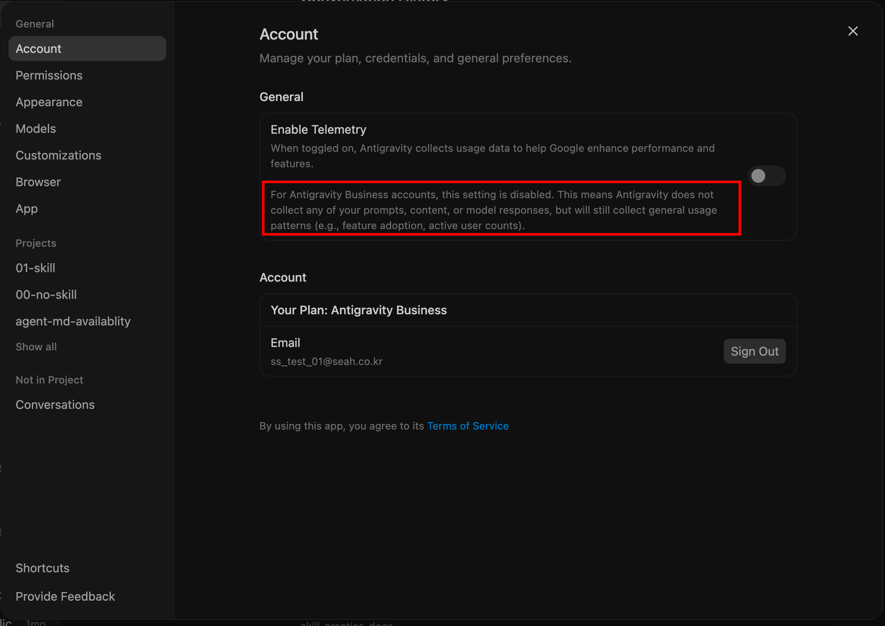

<div class="cover-telemetry"><span>DAY 02 · MISSION SHEET</span><span>실습 4종 · 2026-06</span></div>

<div class="title-block">
<div class="latin-mark">ANTIGRAVITY</div>

# 코드를 몰라도,<br>오늘부터 <em>에이전트</em>를 부립니다

<p class="cover-sub">Google Antigravity로 배우는 바이브 코딩 — 설치와 권한부터 RAG 챗봇의 Cloud Run 배포까지</p>
</div>

<div class="cover-foot"><span>github.com/cozytk/google-antigravity-practice</span><span>GOOGLE WORKSPACE × AI 과정</span></div>

---

<p class="eyebrow">FLIGHT PLAN · 오늘의 비행 계획</p>

# 어제는 도구 <em>안에서</em>, 오늘은 도구를 <em>부립니다</em>

<p class="thesis">1일차: Gems · Sheets · Apps Script — 정해진 도구 안의 자동화. 2일차: 에이전트에게 목표를 주고 결과를 검토하는 방식.</p>

| 모듈 | 내용 | 실습 |
|---|---|---|
| M1 | Antigravity 이해와 설치 — 에이전트, 권한, 계정 | 실습 0 · 설치와 GCP 연동 |
| M2 | 에이전트의 머릿속 — 프로젝트와 컨텍스트 윈도우 | 이론 |
| M3 | Skills — 에이전트에게 전문성 장착하기 | 실습 1 · 타이타닉 대시보드 |
| M4 | RAG와 배포 — File Search, Cloud Run, IAP | 실습 2 · 사내 문서 챗봇 |
| M5 | Workspace 자동화 — `gws`와 API | 참고자료 |

<p class="note"><b>VIBE CODING</b> 원하는 것을 말로 설명하면 AI가 코드를 만들고, 사람은 결과를 검토하는 작업 방식. 오늘의 모든 실습이 이 방식입니다.</p>

---
class: divider
---

<p class="div-no">M1</p>

## Antigravity 이해와 설치

<p class="div-sub">에이전트 관제 센터에 입장하기 — 챗봇과 에이전트의 차이, 권한 체계, 실습 0</p>

<p class="div-file">01_antigravity_basics/</p>

---

<p class="eyebrow">M1 · ANTIGRAVITY BASICS</p>

# 챗봇과 <em>에이전트</em>는 다릅니다

<div class="duo">
<div class="pane">
<h3><span class="latin">CHATBOT</span>Gemini 웹 채팅</h3>
<p>한 번 묻고 한 번 답합니다. 결과물은 텍스트 답변이고, 내 컴퓨터에는 접근할 수 없습니다.</p>
<p>사람의 역할: 질문하기.</p>
</div>
<div class="pane key">
<h3><span class="latin">AGENT</span>코드 에이전트</h3>
<p>목표를 주면 계획 → 실행 → 검증을 스스로 반복합니다. 내 컴퓨터에서 파일을 만들고, 터미널 명령을 실행하고, 브라우저를 조작합니다.</p>
<p>사람의 역할: 목표 제시, 계획 승인, 결과 검토.</p>
</div>
</div>

<p class="note"><b>ANTIGRAVITY</b> Google의 에이전트 우선(agent-first) 플랫폼. 공식 표현은 "AI 에이전트들의 중앙 관제 센터(central command center)" — 사람은 관제사, 에이전트는 비행체입니다.</p>

---

<p class="eyebrow">M1 · ANTIGRAVITY BASICS</p>

# 관제의 4원칙 — 일일이 보지 말고, <em>보고받으세요</em>

<p class="thesis">에이전트의 모든 키 입력을 지켜볼 수는 없습니다. Antigravity의 협업 철학 네 가지.</p>

<div class="quad">
<div class="pane">
<h3><span class="latin">TRUST</span>신뢰</h3>
<p>행동을 실시간 감시하는 대신, 검증하기 쉬운 산출물(계획서·보고서)로 보고받습니다.</p>
</div>
<div class="pane">
<h3><span class="latin">AUTONOMY</span>자율성</h3>
<p>도구와 권한을 충분히 주고 여러 단계를 스스로 진행하게 합니다.</p>
</div>
<div class="pane">
<h3><span class="latin">FEEDBACK</span>피드백</h3>
<p>Google Docs에 댓글 달듯, 산출물 위에 코멘트를 남겨 수정시킵니다.</p>
</div>
<div class="pane">
<h3><span class="latin">SELF-IMPROVE</span>자가개선</h3>
<p>승인한 권한과 피드백이 쌓여 점점 내 방식에 맞게 일합니다.</p>
</div>
</div>

<p class="note"><b>SOURCE</b> 출시 블로그 · antigravity.google/blog/introducing-google-antigravity</p>

---

<p class="eyebrow">M1 · ANTIGRAVITY BASICS</p>

# 이름이 셋 — 오늘 타는 기체는 <em>2.0</em>

| 구분 | 형태 | 출시 | 한 줄 설명 |
|---|---|---|---|
| Antigravity IDE | 데스크톱 IDE | 2025.11 | 코드 편집기(VS Code 계열) 안에 에이전트가 들어 있는 구버전 |
| **Antigravity 2.0** | **독립 GUI 앱** | 2026.05 | IDE 없이 에이전트 대화와 산출물 검토가 중심인 데스크톱 앱 |
| Antigravity CLI | 터미널 앱 `agy` | 2026.05 | 같은 엔진을 터미널에서 — 설정·권한이 2.0과 자동 동기화 |

<p class="thesis">구분법: 앱 아이콘이 흰 배경이면 2.0, 검은 그리드면 구 IDE입니다.</p>

<p class="note"><b>WHY 2.0</b> Google은 "코딩을 넘어 모든 지식 노동의 인터페이스"로 확장하려고 에이전트 화면을 IDE에서 분리했습니다. Gemini CLI도 Antigravity CLI로 통합 진행 중.</p>

---
class: compact
---

<p class="eyebrow">M1 · 실습 0 · SETUP_GUIDE.md</p>

# 실습 0 — 설치 전, 내 <em>경로</em>부터 고르세요

<div class="duo">
<div class="pane">
<h3><span class="latin">PATH A</span>Antigravity만 쓴다</h3>
<p>에이전트로 코딩만 하면 됨. Google Cloud를 호출할 일 없음.</p>
<p>→ 앱 설치 후 로그인만 하면 끝.</p>
</div>
<div class="pane key">
<h3><span class="latin">PATH B</span>Cloud Run 배포까지 (오늘 실습 2)</h3>
<p>만든 앱을 배포하거나 코드가 GCP를 호출함 → 앱 로그인 + <code>gcloud</code> CLI + ADC 인증 파일까지 필요.</p>
</div>
</div>

<div class="steps">
<div><b>gcloud CLI 설치</b><span>Google Cloud를 터미널 명령으로 조작하는 공식 도구. 기존 설치가 있다면 삭제 후 재설치</span></div>
<div><b><code>gcloud auth login</code> → <code>gcloud auth application-default login</code></b><span>두 번째 명령이 ADC(프로그램이 내 Google 권한으로 일하기 위한 로컬 인증 파일)를 만듭니다</span></div>
<div><b>로그인은 "Use Google Cloud project instead"로</b><span>개인 계정 로그인 말고 GCP 프로젝트 로그인 — 조직의 데이터 보호 정책이 적용됩니다</span></div>
</div>

<p class="note"><b>CHECK</b> 새 폴더에서 "hello.txt 만들어줘"가 동작하면 설치 완료.</p>

---

<p class="eyebrow">M1 · PERMISSIONS</p>

# 권한은 <em>신호등</em>입니다 — Deny · Ask · Allow

<div class="trio">
<div class="pane">
<h3><i class="sig nogo">NO-GO · Deny</i></h3>
<p>무조건 차단. 예: 폴더 통째 삭제 명령.</p>
</div>
<div class="pane">
<h3><i class="sig hold">HOLD · Ask</i></h3>
<p>실행 전에 승인 카드로 물어봄. <strong>설정 안 한 모든 동작의 기본값.</strong></p>
</div>
<div class="pane">
<h3><i class="sig go">GO · Allow</i></h3>
<p>자동 승인. 같은 대상이 겹치면 우선순위는 Deny &gt; Ask &gt; Allow.</p>
</div>
</div>

| 기본 동작 | 신호 |
|---|---|
| 프로젝트 폴더 **안** 파일 읽기/쓰기 | GO — 에이전트의 작업 책상이므로 자유 |
| 터미널 명령 · 폴더 **밖** 파일 · MCP | HOLD — 매번 승인 카드 |
| 웹/네트워크 접근 | HOLD — 프로젝트에서 `read_url(*)` 허용 전까지 매번 물어봄 |

<p class="note"><b>HABIT</b> 오늘 수업에서 가장 중요한 습관 — 승인 카드가 뜨면 무엇을 허용하는지 읽고 승인하기.</p>

---

<p class="eyebrow">M1 · PERMISSIONS</p>

# 권한은 두 층 — 글로벌 위에 <em>프로젝트</em>가 쌓입니다

<div class="duo">
<div class="pane">
<h3><span class="latin">GLOBAL</span>기본 권한</h3>
<p>모든 프로젝트 공통. 예: 어디서든 위험 명령은 Deny.</p>
</div>
<div class="pane">
<h3><span class="latin">PROJECT</span>프로젝트 권한</h3>
<p>글로벌을 상속 + 이 폴더만의 허용 추가. 대화 중 승인한 권한은 저장되어 다음부터 안 물어봅니다.</p>
</div>
</div>

<div class="duo">
<div class="pane">
<h3><span class="latin">SANDBOX</span>샌드박스 모드</h3>
<p>터미널 명령을 격리 공간에서 실행 — 파일 권한이 접근 목록으로, <code>read_url</code> 도메인이 네트워크 허용 목록으로 그대로 적용됩니다.</p>
</div>
<div class="pane">
<h3><span class="latin">AUTO-EXEC</span>터미널 자동 실행 정책</h3>
<p><strong>Request Review</strong>(허용 목록 외 전부 승인 요청 — 수업 권장) vs Always Proceed(차단 목록 외 자동 실행).</p>
</div>
</div>

---

<p class="eyebrow">M1 · ARTIFACTS</p>

# 에이전트는 <em>보고서</em>로 말합니다 — Artifacts

<div class="duo">
<div class="pane">
<h3><span class="latin">BEFORE</span>Implementation Plan — 계획서</h3>
<p>코드를 고치기 전에 만드는 기술 계획. <strong>Proceed</strong>로 승인하거나, 인라인 코멘트로 수정시킵니다.</p>
</div>
<div class="pane">
<h3><span class="latin">AFTER</span>Walkthrough — 결과 보고서</h3>
<p>작업 후 무엇이 어떻게 바뀌었는지 요약. 브라우저 작업이면 스크린샷·녹화 포함.</p>
</div>
</div>

| 실행 모드 | 동작 | 언제 |
|---|---|---|
| Planning Mode | 계획서를 먼저 만들고 승인받은 후 실행 | 중요한 작업, 처음 해보는 작업 |
| Fast Mode | 계획 없이 즉시 실행 | 사소한 수정, 빠른 실험 |

<p class="note"><b>BROWSER</b> 에이전트는 별도 Chrome 프로필(내 로그인·쿠키와 격리)로 결과물을 직접 열어 검증합니다.</p>

---

<p class="eyebrow">M1 · ACCOUNT &amp; DATA</p>

# 회사에서 쓸 때 — 내 프롬프트는 <em>어디로</em> 가나

<div class="split">
<div>

| 계정 | 데이터 정책 |
|---|---|
| **Business / 조직** | 텔레메트리 비활성 — 프롬프트·코드·응답 **미수집**. 익명화된 사용 통계(기능 사용 여부 등)만 수집 |
| 개인 무료 | 설정에서 옵트아웃하지 않으면 입력이 모델 개선에 활용될 수 있음 |

<p class="note"><b>RULE</b> 회사 업무 데이터는 반드시 회사 계정 정책 아래에서. 요금제: 무료 / AI Pro / AI Ultra / 조직(Google Cloud 경유).</p>

</div>
<div>

<p class="imgcap">Business 계정 설정 화면 — 텔레메트리 토글이 비활성화되어 있다</p>
</div>
</div>

---
class: divider
---

<p class="div-no">M2</p>

## 에이전트의 머릿속

<p class="div-sub">프로젝트는 작업실, 컨텍스트 윈도우는 단기 기억 — 에이전트가 가끔 멍청해지는 이유</p>

<p class="div-file">02_code_agent_context/</p>

---

<p class="eyebrow">M2 · PROJECT</p>

# 폴더 하나 = 프로젝트 하나 = <em>작업실</em> 하나

<div class="trio">
<div class="pane">
<h3>경계</h3>
<p>에이전트는 기본적으로 그 폴더 안에서만 읽고 씁니다. 밖으로 나가려면 허락이 필요합니다.</p>
</div>
<div class="pane">
<h3>분리 보관</h3>
<p>권한, 설정, 대화 기록이 폴더별로 따로 관리됩니다.</p>
</div>
<div class="pane">
<h3>묶기</h3>
<p>프론트엔드 + 백엔드처럼 여러 폴더를 한 프로젝트로 묶을 수도 있습니다.</p>
</div>
</div>

<p class="note"><b>TIP</b> 업무 자동화 건마다 폴더를 따로 만드세요 — "보고서자동화", "설문분석"처럼. 권한도 기록도 깔끔하게 분리됩니다.</p>

---

<p class="eyebrow">M2 · CONTEXT WINDOW</p>

# 컨텍스트 윈도우 — 에이전트의 <em>단기 기억</em>

<p class="thesis">지금 이 대화에서 AI가 아는 모든 것이 들어 있는 공간. 크기는 토큰(한국어 1글자 ≈ 1~2토큰)으로 셉니다.</p>

<div class="trio">
<div class="pane">
<h3>유한하다</h3>
<p>"20만 토큰"이면 대략 책 한 권. 다 차면 오래된 내용을 요약하거나 버립니다.</p>
</div>
<div class="pane">
<h3>시작 전부터 차 있다</h3>
<p>시스템 지침, 프로젝트 설정 파일, 도구 목록이 입력 전에 이미 로드 — 내 프롬프트는 그에 비해 아주 작습니다.</p>
</div>
<div class="pane">
<h3>안 보여도 차지한다</h3>
<p>화면엔 "파일을 읽었습니다" 한 줄이지만, 실제로는 파일 전체가 기억에 들어갑니다.</p>
</div>
</div>

<p class="note"><b>SYMPTOM</b> 대화가 길어지면 앞말을 까먹는다 · 엉뚱한 파일을 고친다 · 새 대화에서 더 잘한다 — 버그가 아니라 이 구조 때문입니다.</p>

---

<p class="eyebrow">M2 · CONTEXT WINDOW</p>

# 기억을 차지하는 것들 — <em>파일 읽기</em>가 지배합니다

| 항목 | 화면에 보이나? | 기억 점유 |
|---|---|---|
| 시스템 지침 ("너는 코딩 에이전트다") | 안 보임 | 시작부터 고정 |
| 프로젝트 설정 파일 (`AGENTS.md`) | 안 보임 | 매 대화 자동 로드 |
| 도구·스킬 목록 | 안 보임 | 이름과 설명만 |
| 내 지시와 에이전트의 답변 | 보임 | 쌓이는 만큼 |
| **에이전트가 읽은 파일** | 한 줄 요약만 | **전체 내용 — 최대 점유** |
| 터미널 출력, 테스트 결과 | 일부만 | 전부 들어감 |

<p class="note"><b>COMPACTION</b> 한계에 다다르면 대화를 요약본으로 교체합니다. 뼈대(요청·고친 파일)는 남지만 읽었던 파일의 정확한 내용은 사라짐 — 긴 대화 끝에 디테일을 까먹는 이유.</p>

---

<p class="eyebrow">M2 · CONTEXT WINDOW</p>

# 기억을 아끼는 <em>5계명</em>

<div class="steps">
<div><b>요청은 구체적으로</b><span>"버그 고쳐줘" 대신 "<code>app.py</code>의 로그인 함수 오류 고쳐줘" — 에이전트가 뒤지는 파일 수가 줄어듭니다</span></div>
<div><b>작업 단위로 대화를 나누기</b><span>한 대화에서 대시보드도 챗봇도 만들지 않기. 새 작업은 새 대화에서</span></div>
<div><b>반복 지시는 AGENTS.md로</b><span>"한국어로 답해, 표로 정리해"를 파일에 적어두면 모든 대화에 자동 적용</span></div>
<div><b>멍청해졌다 싶으면 새 대화</b><span>필요한 맥락만 요약해 다시 주는 편이 빠릅니다</span></div>
<div><b>큰 조사는 서브에이전트에게</b><span>보조 에이전트가 자기 기억으로 읽고 요약만 돌려줍니다 — 메인 기억이 오염되지 않음</span></div>
</div>

---

<p class="eyebrow">M2 · GLOSSARY</p>

# 앞으로 계속 나올 <em>네 단어</em>

<div class="quad">
<div class="pane">
<h3><span class="latin">AGENTS.md</span>에이전트용 안내문</h3>
<p>프로젝트 폴더에 두면 매 대화 시작 시 자동으로 읽히는 규칙 파일.</p>
</div>
<div class="pane">
<h3><span class="latin">SKILLS</span>업무 매뉴얼</h3>
<p>특정 작업을 잘하는 방법을 적은 재사용 폴더. 필요할 때만 로드 — M3에서 자세히.</p>
</div>
<div class="pane">
<h3><span class="latin">SUB-AGENT</span>보조 에이전트</h3>
<p>자기만의 새 기억을 갖고 일한 뒤 요약만 보고하는 부하 에이전트.</p>
</div>
<div class="pane">
<h3><span class="latin">MCP</span>외부 연결 규격</h3>
<p>에이전트를 DB·사내 시스템에 연결하는 표준 — "에이전트용 USB 포트".</p>
</div>
</div>

<p class="note"><b>SUMMARY</b> 좋은 지시란 "필요한 맥락만 정확히 넣어주는 지시"입니다 — 기억은 유한하므로.</p>

---
class: divider
---

<p class="div-no">M3</p>

## Skills — 전문성을 장착하다

<p class="div-sub">AI 양산형 디자인을 벗어나는 법 — frontend-design 스킬로 타이타닉 대시보드 만들기 (실습 1)</p>

<p class="div-file">03_frontend_skills/</p>

---

<p class="eyebrow">M3 · PROBLEM</p>

# AI가 만든 화면은 왜 다 <em>비슷하게</em> 생겼나

<p class="thesis">"AI slop" — 본 듯한, 전형적인 AI 티가 나는 결과물. 모델이 학습 데이터에서 가장 흔한 패턴을 기본값으로 고르기 때문입니다.</p>

<div class="trio">
<div class="pane">
<h3>양산형 룩 ①</h3>
<p>따뜻한 크림색 배경 + 고대비 세리프 제목 + 테라코타 포인트색.</p>
</div>
<div class="pane">
<h3>양산형 룩 ②</h3>
<p>거의 검정 배경 + 형광 초록·주홍 단일 포인트색.</p>
</div>
<div class="pane">
<h3>양산형 룩 ③</h3>
<p>가는 괘선 + 신문처럼 빽빽한 컬럼 레이아웃.</p>
</div>
</div>

<p class="note"><b>QUOTE</b> "셋 다 어떤 의뢰에는 정답이지만, 이것들은 '선택'이 아니라 '디폴트'다." — Anthropic frontend-design 스킬. 해법: 디자인 감각이 아니라 <strong>선택 기준</strong>을 장착하는 것.</p>

---

<p class="eyebrow">M3 · SKILLS</p>

# Skill = 필요한 챕터만 펼치는 <em>매뉴얼</em>

<div class="split">
<div>

```text
my-skill/
├── SKILL.md      # 핵심 지침 (필수)
├── reference.md  # 상세 자료 (선택)
├── examples/     # 예시 (선택)
└── scripts/      # 실행 스크립트 (선택)
```

<p class="note"><b>WHY</b> 전문 지식을 아무리 담아도 평소 기억(컨텍스트)을 낭비하지 않는 구조 — M2와 연결됩니다.</p>

</div>
<div>

| 단계 | 로드되는 것 | 시점 |
|---|---|---|
| 1 | 이름 + 한 줄 설명 | 항상 (거의 0 토큰) |
| 2 | SKILL.md 본문 | 관련 작업이 올 때 |
| 3 | 참조 파일들 | 실제로 필요할 때 |

<p class="thesis">이 로딩 방식을 점진적 공개(progressive disclosure)라고 부릅니다. Antigravity는 <code>.agents/skills/</code> 폴더의 스킬을 인식합니다.</p>

</div>
</div>

---

<p class="eyebrow">M3 · CASE STUDY</p>

# frontend-design 스킬 해부 — <em>잘 쓴 매뉴얼</em>의 조건

<div class="quad">
<div class="pane">
<h3>역할 프레이밍</h3>
<p>"너는 템플릿 시안을 거절한 클라이언트를 둔 디자인 스튜디오의 리드다."</p>
</div>
<div class="pane">
<h3>금지 목록</h3>
<p>AI 양산형 3종 룩을 콕 집어 "디폴트에 자유를 쓰지 마라"고 차단.</p>
</div>
<div class="pane">
<h3>분야별 기준</h3>
<p>타이포는 짝지어 선택, 팔레트는 이름 붙인 4~6색으로 먼저 계획, 과감함은 한 곳에만.</p>
</div>
<div class="pane">
<h3>자기 검증</h3>
<p>"다른 AI도 비슷하게 만들지 않았을까?"를 자문하고 전형적인 부분을 고치게 함.</p>
</div>
</div>

<p class="note"><b>INSIGHT</b> 스킬은 마법이 아니라 잘 쓴 업무 매뉴얼 — 여러분의 보고서 양식, 데이터 검증 규칙도 이렇게 문서화하면 에이전트의 스킬이 됩니다.</p>

---

<p class="eyebrow">M3 · SKILLS vs MCP</p>

# 매뉴얼이냐, 시스템 계정이냐

<div class="duo">
<div class="pane">
<h3><span class="latin">SKILLS</span>지식 — "어떻게"</h3>
<p>일을 <strong>어떻게</strong> 잘할지 적은 마크다운 문서 폴더.</p>
<p>비유: 신입사원에게 주는 업무 매뉴얼.</p>
</div>
<div class="pane">
<h3><span class="latin">MCP</span>연결 — "어디에"</h3>
<p>외부 시스템(DB·사내 서비스)에 <strong>접근하는</strong> 통로(프로토콜).</p>
<p>비유: 신입사원에게 주는 사내 시스템 계정.</p>
</div>
</div>

<p class="note"><b>TOGETHER</b> 경쟁이 아니라 보완 — MCP로 사내 DB에 연결하고, Skill로 그 데이터를 다루는 사내 절차를 가르칩니다.</p>

---

<p class="eyebrow">M3 · 실습 1 · 03_frontend_skills/README.md</p>

# 실습 1 — 타이타닉 대시보드, <em>네 단계</em> 비행

<div class="steps">
<div><b>스킬 장착 — 에이전트에게 시키기</b><span>"anthropics/skills에서 frontend-design을 받아 <code>.agents/skills/</code>에 설치하고 세 줄 요약해줘" — 네트워크·터미널 승인 카드를 직접 읽고 승인하는 첫 경험</span></div>
<div><b><code>/grill-me</code> — 질문받기</b><span>구현 전에 에이전트가 나에게 역질문: 핵심 질문·무드·차트 구성 합의 → <code>REQUIREMENTS.md</code>로 저장 (긴 대화에서 잊히지 않도록)</span></div>
<div><b>구현 — Planning Mode</b><span>계획서를 읽고 Proceed. 패키지 설치·서버 실행 승인 카드 확인 → <code>localhost</code>(내 컴퓨터 전용 주소)에서 열기</span></div>
<div><b><code>/goal</code> — 스스로 완성도 높이기</b><span>완료 조건을 주면 달성까지 실행-검증 반복 — 다음 슬라이드</span></div>
</div>

---

<p class="eyebrow">M3 · 실습 1 · /goal</p>

# `/goal`의 요령 — "하라"가 아니라 <em>"끝의 상태"</em>를 쓰세요

```text
/goal 아래 완료 조건을 전부 만족하는 상태로 만들어줘.
1. localhost에서 오류 없이 실행 (브라우저 콘솔 에러 0건)
2. 모든 차트가 실제 데이터로 정확히 — 전체 생존율 38.4% 직접 계산 검증
3. 객실 등급 필터를 조작하면 모든 차트가 함께 갱신
4. 모바일 크기로 줄여도 레이아웃 유지
5. 스크린샷 자기 평가 — "템플릿 디폴트로 보이는 부분"을 찾아 수정
각 조건을 어떻게 확인했는지 보고해.
```

<div class="trio">
<div class="pane">
<h3>검증 가능하게</h3>
<p>"예쁘게"(검증 불가) 대신 "콘솔 에러 0건"(검증 가능).</p>
</div>
<div class="pane">
<h3>정답 숫자 주기</h3>
<p>생존율 38.4%처럼 정답을 주면 데이터 오류를 스스로 잡습니다.</p>
</div>
<div class="pane">
<h3>보고 의무</h3>
<p>"어떻게 확인했는지 보고해"가 없으면 대충 "됐습니다"로 끝납니다.</p>
</div>
</div>

---
class: divider
---

<p class="div-no">M4</p>

## RAG와 배포

<p class="div-sub">문서를 아는 챗봇 만들기 — File Search, 그리고 Cloud Run으로 세상에 공개하기 (실습 2)</p>

<p class="div-file">04_rag_cloud_run/</p>

---

<p class="eyebrow">M4 · PROBLEM</p>

# AI는 우리 회사 문서를 <em>모릅니다</em>

<div class="duo">
<div class="pane">
<h3>왜 모르나</h3>
<p>모델은 인터넷 공개 데이터로 학습됐습니다. 사내 규정·매뉴얼은 본 적이 없습니다.</p>
</div>
<div class="pane">
<h3>통째로 넣으면 되지 않나</h3>
<p>문서 한두 개면 됩니다. 수백 개면 컨텍스트 윈도우(단기 기억)에 다 안 들어가고, 들어가도 매 질문마다 전체를 읽히는 비용이 큽니다.</p>
</div>
</div>

<p class="note"><b>RAG</b> Retrieval-Augmented Generation, 검색 증강 생성 — 답하기 전에 관련 문서 조각을 먼저 찾아서(검색) 그것을 근거로 답하게(생성) 하는 방식. 모든 책을 외운 사서가 아니라, <strong>색인으로 관련 페이지를 펼쳐놓고 답하는 사서</strong>.</p>

---

<p class="eyebrow">M4 · RAG</p>

# RAG는 <em>두 박자</em> — 인덱싱, 그리고 검색·생성

<p class="thesis">① 사전 작업: 문서를 검색 가능한 형태로 (한 번만)</p>

<div class="flow">
<div><b>Load</b><span>PDF·문서를 읽어 들이기</span></div>
<div><b>Split</b><span>적당한 조각(청크)으로 자르기</span></div>
<div><b>Embed</b><span>의미를 숫자 좌표로 — 비슷한 뜻 = 가까운 좌표</span></div>
<div><b>Store</b><span>벡터 DB에 저장</span></div>
</div>

<p class="thesis">② 실시간: 질문이 들어오면</p>

<div class="flow">
<div><b>Retrieve</b><span>질문과 의미가 가까운 청크 찾기</span></div>
<div><b>Generate</b><span>"이 자료를 근거로 답해" — 출처와 함께 답변</span></div>
</div>

<p class="note"><b>DÉJÀ VU</b> 1일차 GEMS의 "지식" 업로드도 내부에선 이 일이 벌어지고 있었습니다. 오늘은 그 구조를 직접 만듭니다. 덕분에 "휴가 규정" 검색이 "연차 사용 지침" 문서를 찾아냅니다 — 단어가 아니라 의미로 검색.</p>

---

<p class="eyebrow">M4 · FILE SEARCH</p>

# 여섯 부품을 <em>호출 두 개</em>로 — 관리형 RAG

<div class="split">
<div>

```python
# ① 업로드 — 청킹·임베딩·인덱싱 자동
client.file_search_stores.upload_to_file_search_store(
    file=path, file_search_store_name=store.name)

# ② 질문 — 검색+생성이 한 호출로
client.models.generate_content(
    model="gemini-2.5-flash", contents=contents,
    config=...(tools=[FileSearch(store)]))
```

<p class="thesis">직접 만들면: 파서 → 청킹 → 임베딩 → 벡터 DB → 검색기 → 프롬프트 조립. File Search는 이 전부가 API 안으로.</p>

</div>
<div>

| 특징 | 내용 |
|---|---|
| 출처 자동 | 답의 어느 부분이 어느 문서에서 왔는지(citation) 자동 |
| 영구 보관 | 스토어 데이터는 삭제 전까지 유지 |
| 인덱싱 대기 | 문서당 수십 초 — 완료까지 폴링 |
| 형식 | PDF·DOCX·XLSX·TXT·MD 등, 100MB/문서 |

</div>
</div>

---

<p class="eyebrow">M4 · COST</p>

# 비용 구조 — 고정비 <em>0원</em>에서 시작

<div class="split">
<div>

| 항목 | File Search 요금 |
|---|---|
| 스토리지 (보관) | **무료** |
| 인덱싱 임베딩 | $0.15 / 100만 토큰 — 업로드 시 1회 |
| 질문 시 임베딩 | **무료** |
| 검색된 청크 | 모델 입력 토큰으로 과금 |

<p class="thesis">감 잡기: 논문 PDF 10편(33MB) 인덱싱 ≈ 수십 원, 1회로 끝.</p>

</div>
<div>

| | File Search | 직접 구축 |
|---|---|---|
| 고정비 | 사실상 0 | 벡터 DB 월정액 계속 |
| 구축 | 호출 2개 | 부품 6종 직접 연결 |
| 운영 인력 | 불필요 | 필요 |
| 세밀 제어 | 제한적 | 전부 가능 |

</div>
</div>

<p class="note"><b>VERDICT</b> 수십~수천 문서의 사내 Q&A, 출처 표시 챗봇, 프로토타입 → File Search. 검색 품질을 직접 튜닝해야 하는 대규모 서비스 → 직접 구축.</p>

---

<p class="eyebrow">M4 · GOOGLE CLOUD</p>

# 배포 전에 — Google Cloud <em>지도</em> 한 장

<p class="thesis">배포(deploy) = 내 컴퓨터에서만 도는 프로그램을 서버에 올려 남들도 접속하게 만들기. 24시간 켜둘 컴퓨터를 Google에서 빌립니다.</p>

| 서비스 | 한 줄 소개 |
|---|---|
| Compute Engine | 가상 컴퓨터를 통째로 빌리기 — 전부 직접 제어·관리 |
| **Cloud Run** | 프로그램만 주면 서버 운영은 Google이 — 접속 없으면 0대, 몰리면 자동 증설 (**오늘 사용**) |
| Cloud Storage | 파일·백업을 담는 무제한 저장소 |
| BigQuery | 초대용량 데이터를 SQL로 분석 |
| Vertex AI | AI 모델의 학습·배포·관리 플랫폼 |
| IAM | "누가 · 무엇을 · 어디까지" 권한 관리 |

<p class="note"><b>GCLOUD</b> 이 전부를 터미널 명령으로 조작하는 공식 CLI — 명령이기 때문에 <strong>에이전트에게 시킬 수 있습니다</strong>. 실습 0에서 이미 설치했습니다.</p>

---

<p class="eyebrow">M4 · CLOUD RUN</p>

# 배포는 <em>한 줄</em> — 뒤에서 셋이 일합니다

```bash
gcloud run deploy my-chatbot --source .
```

<div class="flow">
<div><b>Cloud Build</b><span>소스 코드를 컨테이너 이미지로 빌드</span></div>
<div><b>Artifact Registry</b><span>만들어진 이미지를 보관</span></div>
<div><b>Cloud Run</b><span>이미지를 실행하고 <code>https://….run.app</code> 주소 발급</span></div>
</div>

<p class="note"><b>CONTAINER</b> 프로그램 + 실행 환경(언어·라이브러리·설정)을 통째로 포장한 박스 — "내 컴퓨터에선 되는데 서버에선 안 돼요"를 없애는 기술. 한 줄 뒤에서 셋이 협업하지만, 우리는 결과 주소만 받으면 됩니다.</p>

---

<p class="eyebrow">M4 · IAM &amp; IAP</p>

# 회사 사람만 통과 — <em>IAP</em> 검문소

<div class="duo">
<div class="pane">
<h3><span class="latin">IAM</span>권한의 문법</h3>
<p>누가(사용자·그룹) + 무엇을(역할) + 어디에(리소스). 예: 홍길동에게 이 서비스의 호출 권한 <code>roles/run.invoker</code>를 준다.</p>
</div>
<div class="pane">
<h3><span class="latin">IAP</span>Google 로그인 검문소</h3>
<p>서비스 앞에서 Google 계정 로그인을 요구하고 허용된 사람만 통과. Cloud Run엔 <code>--iap</code> 옵션으로 바로 켭니다.</p>
</div>
</div>

```bash
# 회사 도메인 전체 허용 — "@company.com 계정이면 누구나"
gcloud iap web add-iam-policy-binding \
  --member=domain:company.com --role=roles/iap.httpsResourceAccessor \
  --resource-type=cloud-run --service=my-chatbot --region=REGION
```

<p class="note"><b>PATTERN</b> <code>user:</code>(개인) · <code>group:</code>(팀) · <code>domain:</code>(회사 전체) — "Gemini 비즈니스처럼 우리 회사만 쓰는 사내 AI 도구"의 기본 구조입니다.</p>

---

<p class="eyebrow">M4 · 실습 2 · 04_rag_cloud_run/README.md</p>

# 실습 2 — 사내 문서 챗봇, <em>발사 시퀀스</em>

<div class="steps">
<div><b>구현 시키기</b><span>공식 문서 URL을 주고, 아는 함정(한글 인용 마커는 바이트 단위)을 미리 알리고, "API 키는 환경 변수로만" 명시 — 막히면 <code>app/</code>의 참고용 완성본</span></div>
<div><b>로컬 테스트 — 직접 5가지 확인</b><span>화면이 뜨나 · 문서 업로드(수십 초) · 출처와 함께 답하나 · 없는 내용은 모른다고 하나 · 후속 질문에 맥락 유지되나</span></div>
<div><b>Cloud Run 배포</b><span><code>gcloud run deploy --source .</code> 서울 리전 — 발급된 주소를 옆 사람 휴대폰으로 열어보기</span></div>
<div><b>IAP로 잠그기</b><span><code>--no-allow-unauthenticated --iap</code> + 허용 계정 지정 → 시크릿 창으로 차단 확인</span></div>
<div><b>청소</b><span>실습 후 <code>gcloud run services delete</code> + File Search 스토어 삭제 — 과금 방지</span></div>
</div>

---

<p class="eyebrow">M4 · CLOUD RUN vs FIREBASE</p>

# 자주 받는 질문 — "Firebase로 하면 안 되나요?"

| 상황 | 선택 | 이유 |
|---|---|---|
| 정적 웹사이트 (서버 로직 없음) | Firebase Hosting | 전 세계 캐시 + 무료 SSL, 소규모 무료 |
| Next.js 등 최신 웹 프레임워크 | Firebase App Hosting | GitHub 연동 자동 배포, Firebase 서비스 통합 |
| **API 서버 · 챗봇 백엔드 · 사내 도구** | **Cloud Run** | 어떤 언어든, IAP 접근 제어 등 인프라 제어 |

<p class="note"><b>FYI</b> App Hosting도 내부적으로는 Cloud Run 위에서 돌아갑니다 — Firebase는 쉽게 포장한 세트, Cloud Run은 원판. IAP가 필요한 사내 도구라면 Cloud Run이 정답에 가깝습니다.</p>

---

<p class="eyebrow">M5 · 참고자료 · 05_workspace_automation/</p>

# 다음 비행 — Workspace를 <em>에이전트 손에</em>

<div class="duo">
<div class="pane key">
<h3><span class="latin">GWS</span>Google Workspace CLI</h3>
<p>Gmail·Drive·Calendar·Sheets·Docs를 터미널 명령 하나로 (2026.3 공개 오픈소스). 응답이 전부 JSON이고 MCP 서버 내장 — 에이전트에 바로 연결됩니다.</p>
<p><code>gws calendar +agenda</code> · <code>gws gmail +send</code></p>
</div>
<div class="pane">
<h3>판단 기준 한 줄</h3>
<p>"폼 제출 → 시트 기록 → 메일 발송"처럼 Workspace 안에서 끝나면 1일차의 Apps Script.</p>
<p>외부 데이터·AI·대량 처리가 끼면 API 직접 호출 — 에이전트 + <code>gws</code>가 가장 빠른 진입점.</p>
</div>
</div>

<p class="note"><b>HOMEWORK</b> "gws를 설치하고 이번 주 내 일정을 요일별 마크다운 보고서로 만들어줘" — 권한 카드·로그인 동의까지, 이틀간 배운 권한 개념이 한 번에 등장합니다.</p>

---

<p class="eyebrow">DEBRIEF · 착륙 보고</p>

# 오늘 가져가는 것 — <em>다섯 가지</em>

<div class="checklist">

- 에이전트와 챗봇의 차이 — 그리고 권한 승인 카드를 읽는 습관
- 컨텍스트 윈도우 — 에이전트가 멍청해지는 이유와 5계명
- Skills — 내 업무 매뉴얼을 에이전트에게 장착하는 법
- `/grill-me`와 `/goal` — 만들기 전에 묻게 하고, 끝의 상태로 시키기
- RAG 챗봇을 만들고 Cloud Run + IAP로 "우리 회사만" 배포하는 법

</div>

<p class="refs">
교안 · github.com/cozytk/google-antigravity-practice<br>
Antigravity 공식 문서 · antigravity.google/docs<br>
File Search · ai.google.dev/gemini-api/docs/file-search &nbsp;·&nbsp; 컨텍스트 윈도우 · code.claude.com/docs/ko/context-window
</p>
